# Архитектура и связи приложения Accounts

## 🎯 Обзор

Данный документ описывает архитектуру приложения `accounts`, связи с другими приложениями, модели данных и принципы взаимодействия компонентов системы.

---

## 📋 Содержание

1. [Архитектура приложения](#архитектура-приложения)
2. [Модели данных](#модели-данных)
3. [Связи с другими приложениями](#связи-с-другими-приложениями)
4. [Сервисный слой](#сервисный-слой)
5. [API архитектура](#api-архитектура)
6. [Безопасность](#безопасность)
7. [Производительность](#производительность)
8. [Масштабируемость](#масштабируемость)

---

## 🏗️ Архитектура приложения

### 1. Общая архитектура

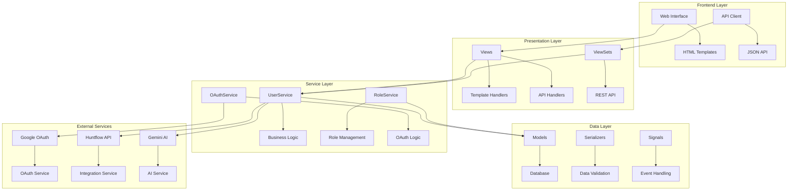

### 2. Принципы архитектуры

#### 2.1 Single Responsibility Principle (SRP)
- **UserService:** Управление пользователями
- **RoleService:** Управление ролями и правами
- **OAuthService:** OAuth операции
- **AuthAdapters:** Адаптеры аутентификации

#### 2.2 Open/Closed Principle (OCP)
- Сервисы открыты для расширения
- Закрыты для модификации
- Легкость добавления новых функций

#### 2.3 Liskov Substitution Principle (LSP)
- Все сервисы взаимозаменяемы
- Единый интерфейс для всех сервисов
- Консистентное поведение

#### 2.4 Interface Segregation Principle (ISP)
- Разделение интерфейсов по функциональности
- Клиенты не зависят от неиспользуемых методов
- Четкие границы ответственности

#### 2.5 Dependency Inversion Principle (DIP)
- Зависимость от абстракций, а не от конкретных реализаций
- Инверсия управления через Django
- Слабая связанность компонентов

### 3. Слои архитектуры

#### 3.1 Presentation Layer (Слой представления)
```python
# Views для веб-интерфейса
def profile_template_handler(request):
    context = UserService.get_user_profile_data(request.user)
    return render(request, 'profile/profile.html', context)

# ViewSets для REST API
class UserViewSet(viewsets.ModelViewSet):
    queryset = User.objects.all()
    serializer_class = UserSerializer
```

#### 3.2 Service Layer (Сервисный слой)
```python
# Бизнес-логика пользователей
class UserService:
    @staticmethod
    def get_user_profile_data(user):
        # Логика получения данных профиля
        pass
    
    @staticmethod
    def update_user_api_keys(user, data):
        # Логика обновления API ключей
        pass

# Управление ролями
class RoleService:
    @staticmethod
    def assign_role_to_user(user, role_name):
        # Логика назначения ролей
        pass
```

#### 3.3 Data Layer (Слой данных)
```python
# Модели данных
class User(AbstractUser):
    # Расширенная модель пользователя
    pass

# Сериализаторы
class UserSerializer(serializers.ModelSerializer):
    # Сериализация данных
    pass

# Сигналы
@receiver(post_save, sender=User)
def create_user_profile(sender, instance, created, **kwargs):
    # Обработка событий
    pass
```

---

## 📊 Модели данных

### 1. Основная модель User

```python
class User(AbstractUser):
    """
    Расширенная модель пользователя с полями для интеграций
    """
    # Основные поля
    full_name = models.CharField(_("ФИО"), max_length=255, blank=True)
    telegram_username = models.CharField(_("Никнейм Telegram"), max_length=64, blank=True)

    # API ключи интеграций
    gemini_api_key = models.CharField(_("API ключ Gemini"), max_length=256, blank=True)
    clickup_api_key = models.CharField(_("API ключ ClickUp"), max_length=256, blank=True)
    notion_integration_token = models.CharField(_("Integration токен Notion"), max_length=256, blank=True)

    # Huntflow настройки
    huntflow_prod_url = models.URLField(_("Huntflow прод: ссылка"), blank=True)
    huntflow_prod_api_key = models.CharField(_("Huntflow прод: API ключ"), max_length=256, blank=True)
    huntflow_sandbox_url = models.URLField(_("Huntflow песочница: ссылка"), blank=True)
    huntflow_sandbox_api_key = models.CharField(_("Huntflow песочница: API ключ"), max_length=256, blank=True)
    active_system = models.CharField(
        _("Активная система"),
        max_length=16,
        choices=SystemChoice.choices,
        default=SystemChoice.SANDBOX,
    )

    # Поля для ролей
    interviewer_calendar_url = models.URLField(_("Ссылка на календарь интервьюера"), blank=True)
    is_observer_active = models.BooleanField(_("Статус наблюдателя"), default=False)
```

### 2. Свойства ролей

```python
@property
def is_admin(self) -> bool:
    """Проверка роли администратора"""
    return self.is_superuser or self.groups.filter(name="Администраторы").exists()

@property
def is_recruiter(self) -> bool:
    """Проверка роли рекрутера"""
    return self.groups.filter(name="Рекрутеры").exists()

@property
def is_interviewer(self) -> bool:
    """Проверка роли интервьюера"""
    return self.groups.filter(name="Интервьюеры").exists()

@property
def is_observer(self) -> bool:
    """Проверка роли наблюдателя"""
    return self.groups.filter(name="Наблюдатели").exists()
```

### 3. Система выбора

```python
class SystemChoice(models.TextChoices):
    PROD = "prod", _("Прод")
    SANDBOX = "sandbox", _("Песочница")
```

### 4. Связи с другими моделями

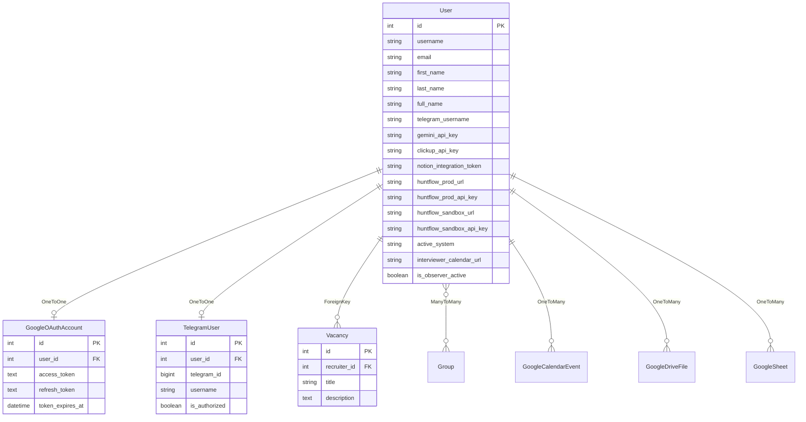

---

## 🔗 Связи с другими приложениями

### 1. Google OAuth (apps.google_oauth)

#### Связь:
```python
# OneToOne связь
class GoogleOAuthAccount(models.Model):
    user = models.OneToOneField(User, on_delete=models.CASCADE)
    access_token = models.TextField()
    refresh_token = models.TextField()
    token_expires_at = models.DateTimeField()
```

#### Взаимодействие:
- **Авторизация:** OAuth 2.0 flow
- **Данные:** Календарь, Drive, Sheets
- **API ключи:** `User.gemini_api_key`
- **Синхронизация:** Автоматическая при авторизации

#### Рабочий процесс:
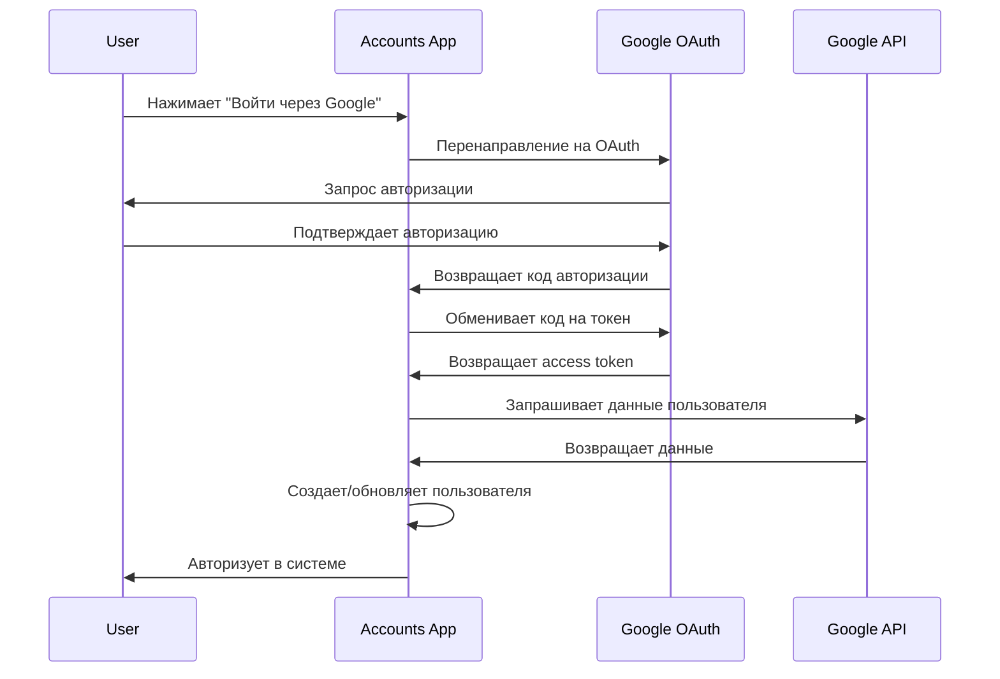

### 2. Huntflow (apps.huntflow)

#### Связь:
```python
# API ключи в модели User
huntflow_prod_api_key = models.CharField(max_length=256, blank=True)
huntflow_sandbox_api_key = models.CharField(max_length=256, blank=True)
huntflow_prod_url = models.URLField(blank=True)
huntflow_sandbox_url = models.URLField(blank=True)
active_system = models.CharField(choices=SystemChoice.choices, default=SystemChoice.SANDBOX)
```

#### Взаимодействие:
- **Данные:** Кандидаты, вакансии, интервью
- **API:** REST API Huntflow
- **Системы:** Prod и Sandbox
- **Роли:** Рекрутеры и администраторы

#### Рабочий процесс:
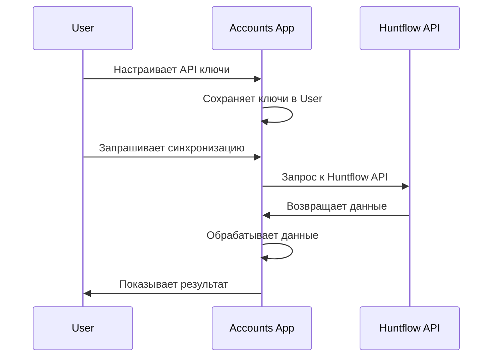

### 3. Gemini AI (apps.gemini)

#### Связь:
```python
# API ключ в модели User
gemini_api_key = models.CharField(max_length=256, blank=True)
```

#### Взаимодействие:
- **Функции:** AI анализ, чат, генерация контента
- **API:** Google Gemini API
- **Использование:** Анализ резюме, генерация описаний вакансий

#### Рабочий процесс:
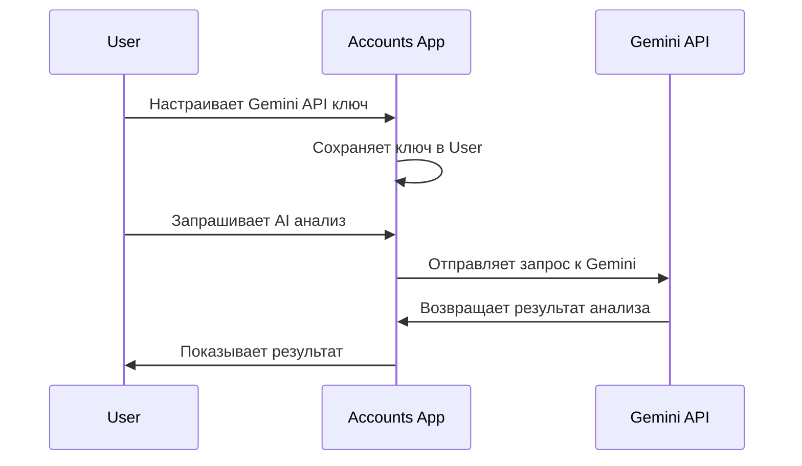

### 4. Telegram (apps.telegram)

#### Связь:
```python
# OneToOne связь
class TelegramUser(models.Model):
    user = models.OneToOneField(User, on_delete=models.CASCADE)
    telegram_id = models.BigIntegerField(unique=True)
    username = models.CharField(max_length=64, blank=True)
    is_authorized = models.BooleanField(default=False)

# Поле в User
telegram_username = models.CharField(max_length=64, blank=True)
```

#### Взаимодействие:
- **Функции:** Уведомления, бот-команды
- **Авторизация:** Через Telegram бота
- **Синхронизация:** Статусы интервью

#### Рабочий процесс:
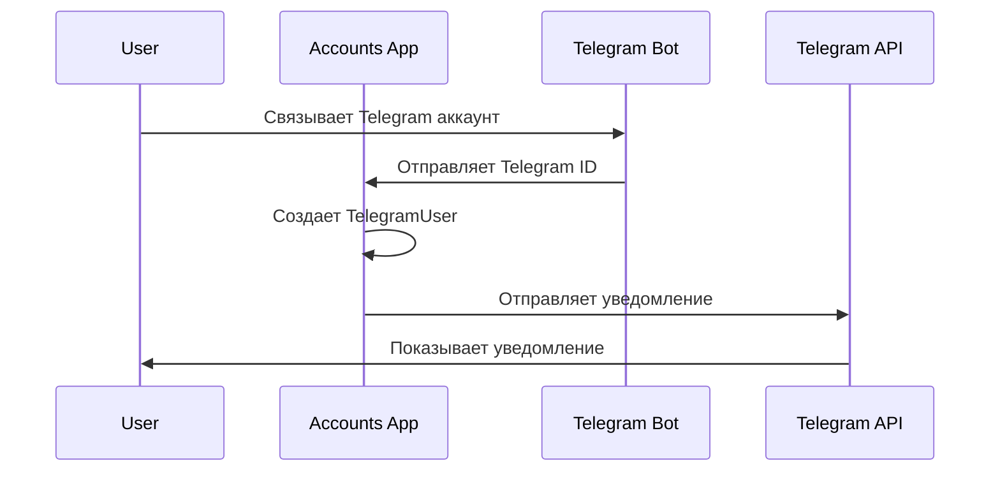

### 5. Notion (apps.notion_int)

#### Связь:
```python
# Integration Token в модели User
notion_integration_token = models.CharField(max_length=256, blank=True)
```

#### Взаимодействие:
- **Данные:** Страницы, базы данных
- **API:** Notion API
- **Синхронизация:** Двусторонняя

#### Рабочий процесс:
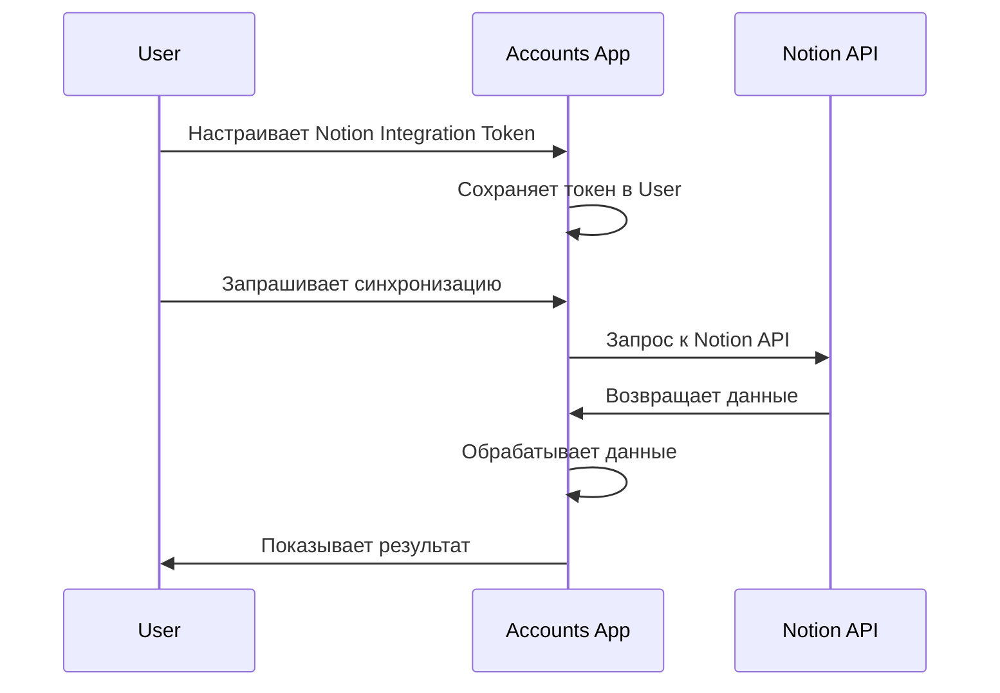

### 6. ClickUp (apps.clickup_int)

#### Связь:
```python
# API ключ в модели User
clickup_api_key = models.CharField(max_length=256, blank=True)
```

#### Взаимодействие:
- **Данные:** Задачи, проекты, команды
- **API:** ClickUp API
- **Синхронизация:** Задачи и статусы

#### Рабочий процесс:
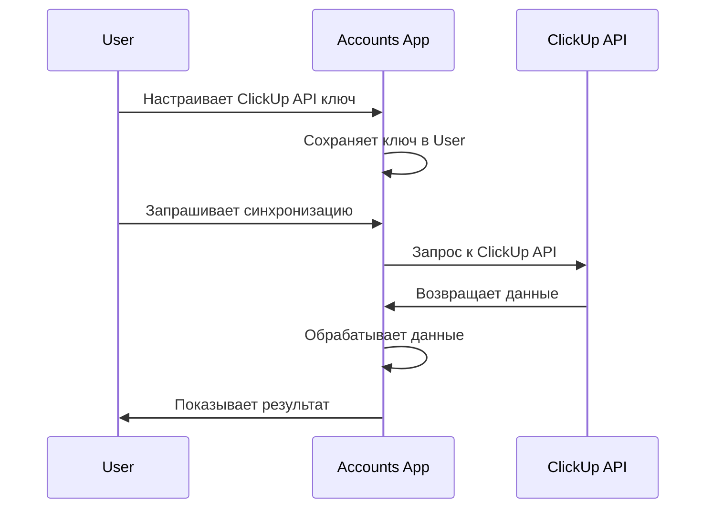

### 7. Interviewers (apps.interviewers)

#### Связь:
```python
# Поле в модели User
interviewer_calendar_url = models.URLField(blank=True)

# Связь через группы
def is_interviewer(self) -> bool:
    return self.groups.filter(name="Интервьюеры").exists()
```

#### Взаимодействие:
- **Функции:** Управление интервью, календарь
- **Роли:** Группа "Интервьюеры"
- **Данные:** Календарь, интервью, кандидаты

#### Рабочий процесс:
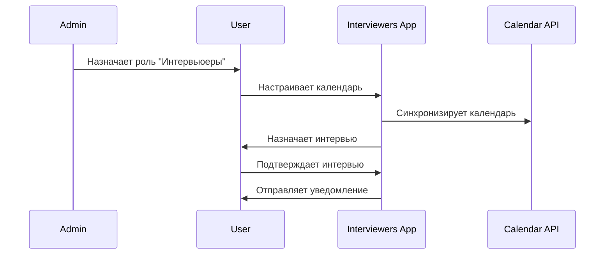

### 8. Vacancies (apps.vacancies)

#### Связь:
```python
# В модели Vacancy
class Vacancy(models.Model):
    recruiter = models.ForeignKey(User, on_delete=models.CASCADE)
    title = models.CharField(max_length=255)
    description = models.TextField()
    # ... другие поля
```

#### Взаимодействие:
- **Функции:** Управление вакансиями, анализ
- **Роли:** Рекрутеры и администраторы
- **Данные:** Вакансии, требования, кандидаты

#### Рабочий процесс:
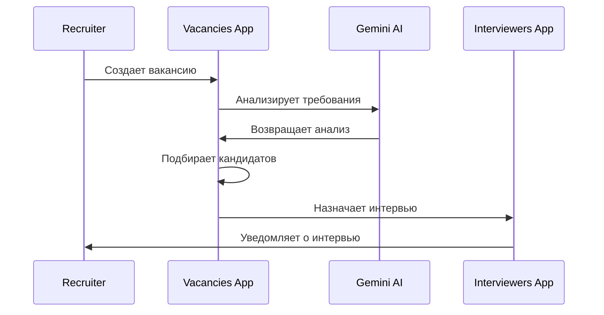

---

## ⚙️ Сервисный слой

### 1. UserService

#### Ответственности:
- Управление пользователями
- Получение данных профиля
- Обновление API ключей
- Статистика пользователей

#### Методы:
```python
class UserService:
    @staticmethod
    def get_user_profile_data(user):
        """Получение данных профиля пользователя"""
        pass
    
    @staticmethod
    def get_integrations_status(user):
        """Получение статуса интеграций"""
        pass
    
    @staticmethod
    def update_user_api_keys(user, data):
        """Обновление API ключей пользователя"""
        pass
    
    @staticmethod
    def get_user_stats():
        """Получение статистики пользователей"""
        pass
    
    @staticmethod
    def create_user_with_observer_role(user_data):
        """Создание пользователя с ролью наблюдателя"""
        pass
```

### 2. RoleService

#### Ответственности:
- Управление ролями и группами
- Назначение ролей пользователям
- Валидация прав доступа
- Статистика ролей

#### Методы:
```python
class RoleService:
    @staticmethod
    def create_roles_and_permissions():
        """Создание групп ролей и назначение прав"""
        pass
    
    @staticmethod
    def assign_role_to_user(user, role_name):
        """Назначение роли пользователю"""
        pass
    
    @staticmethod
    def remove_role_from_user(user, role_name):
        """Удаление роли у пользователя"""
        pass
    
    @staticmethod
    def get_role_statistics():
        """Получение статистики по ролям"""
        pass
    
    @staticmethod
    def validate_role_permissions():
        """Проверка корректности прав"""
        pass
```

### 3. GoogleOAuthService

#### Ответственности:
- OAuth операции
- Получение URL авторизации
- Обработка callback
- Управление токенами

#### Методы:
```python
class GoogleOAuthService:
    @staticmethod
    def get_authorization_url(request):
        """Получить URL для авторизации"""
        pass
    
    @staticmethod
    def handle_oauth_callback(request):
        """Обработка callback от OAuth"""
        pass
    
    @staticmethod
    def _exchange_code_for_token(code, request):
        """Обмен кода на токен"""
        pass
    
    @staticmethod
    def _get_user_info(access_token):
        """Получение информации о пользователе"""
        pass
    
    @staticmethod
    def _create_or_get_user(user_data):
        """Создание или поиск пользователя"""
        pass
```

---

## 🔌 API архитектура

### 1. REST API (DRF ViewSets)

#### UserViewSet:
```python
class UserViewSet(viewsets.ModelViewSet):
    """ViewSet для управления пользователями"""
    queryset = User.objects.all()
    serializer_class = UserSerializer
    permission_classes = [permissions.IsAuthenticated]
    
    # Базовые операции CRUD
    def list(self, request):
        """Список пользователей"""
        pass
    
    def create(self, request):
        """Создание пользователя"""
        pass
    
    def retrieve(self, request, pk=None):
        """Получение пользователя"""
        pass
    
    def update(self, request, pk=None):
        """Обновление пользователя"""
        pass
    
    def destroy(self, request, pk=None):
        """Удаление пользователя"""
        pass
    
    # Кастомные действия
    @action(detail=False, methods=['get'])
    def profile(self, request):
        """Профиль текущего пользователя"""
        pass
    
    @action(detail=False, methods=['get'])
    def stats(self, request):
        """Статистика пользователей"""
        pass
```

### 2. JSON API

#### Универсальные функции:
```python
@csrf_exempt
def unified_api_view(request, handler_func):
    """Универсальная функция для JSON API"""
    if request.method != 'POST':
        return HttpResponseNotAllowed(['POST'])
    
    try:
        data = json.loads(request.body.decode('utf-8'))
    except json.JSONDecodeError:
        return JsonResponse({'error': 'Invalid JSON'}, status=400)
    
    response_data = handler_func(data, request)
    return JsonResponse(response_data)

# API handlers
def login_api_handler(data, request):
    """Обработчик входа в систему"""
    pass

def test_gemini_api_handler(data, request):
    """Обработчик тестирования Gemini API"""
    pass
```

### 3. Веб-интерфейс

#### Template handlers:
```python
def profile_template_handler(request):
    """Обработчик страницы профиля"""
    context = UserService.get_user_profile_data(request.user)
    return render(request, 'profile/profile.html', context)

def integrations_template_handler(request):
    """Обработчик страницы интеграций"""
    integrations_status = UserService.get_integrations_status(request.user)
    context = {
        'user': request.user,
        'integrations': integrations_status,
    }
    return render(request, 'profile/integrations.html', context)
```

---

## 🔒 Безопасность

### 1. Аутентификация

#### Методы:
- **Session Authentication:** Django сессии
- **Google OAuth 2.0:** Социальная авторизация
- **JSON API Authentication:** API токены

#### Безопасность:
```python
# CSRF защита
@csrf_exempt  # Только для API endpoints
def unified_api_view(request, handler_func):
    pass

# State parameter для OAuth
state = secrets.token_urlsafe(32)
request.session['oauth_state'] = state

# Валидация данных
def validate_api_key(api_key):
    if not api_key or len(api_key) < 10:
        return False
    return True
```

### 2. Авторизация

#### Система ролей:
```python
# Проверка прав доступа
def get_queryset(self):
    user = self.request.user
    queryset = super().get_queryset()
    
    # Если пользователь не админ, показываем только себя
    if not user.is_superuser and not user.is_staff:
        queryset = queryset.filter(pk=user.pk)
    
    return queryset

# Права доступа
class UserViewSet(viewsets.ModelViewSet):
    permission_classes = [permissions.IsAuthenticated]
```

### 3. Защита данных

#### API ключи:
```python
# Хранение в зашифрованном виде
gemini_api_key = models.CharField(max_length=256, blank=True)

# Валидация через тестовые запросы
def test_gemini_api_handler(data, request):
    api_key = data.get('api_key')
    if not api_key or len(api_key) < 10:
        return {'success': False, 'message': 'API ключ не указан'}
    
    # Тестовый запрос к API
    try:
        response = requests.get(f"https://api.gemini.com/test?key={api_key}")
        if response.status_code == 200:
            return {'success': True, 'message': 'API ключ валиден'}
        else:
            return {'success': False, 'message': 'API ключ невалиден'}
    except:
        return {'success': False, 'message': 'Ошибка при тестировании API'}
```

---

## ⚡ Производительность

### 1. Оптимизация запросов

#### N+1 проблемы:
```python
# Оптимизированный запрос
users = User.objects.select_related('groups').prefetch_related('groups__permissions')

# Кэширование статистики
@cached_property
def user_stats(self):
    return UserService.get_user_stats()

# Оптимизация групп
def get_user_stats():
    groups_stats = {}
    for group in Group.objects.all():
        groups_stats[group.name] = group.user_set.count()
    return groups_stats
```

### 2. Кэширование

#### Стратегии:
```python
from django.core.cache import cache

def get_user_stats():
    cache_key = 'user_stats'
    stats = cache.get(cache_key)
    if not stats:
        stats = UserService.get_user_stats()
        cache.set(cache_key, stats, 300)  # 5 минут
    return stats

# Кэширование ролей
def get_role_statistics():
    cache_key = 'role_statistics'
    stats = cache.get(cache_key)
    if not stats:
        stats = RoleService.get_role_statistics()
        cache.set(cache_key, stats, 600)  # 10 минут
    return stats
```

### 3. Асинхронность

#### Celery задачи:
```python
from celery import shared_task

@shared_task
def sync_huntflow_data(user_id):
    """Синхронизация данных Huntflow"""
    user = User.objects.get(id=user_id)
    # Синхронизация данных
    pass

@shared_task
def send_notification(user_id, message):
    """Отправка уведомления"""
    user = User.objects.get(id=user_id)
    # Отправка уведомления
    pass
```

---

## 📈 Масштабируемость

### 1. Горизонтальное масштабирование

#### Микросервисная архитектура:
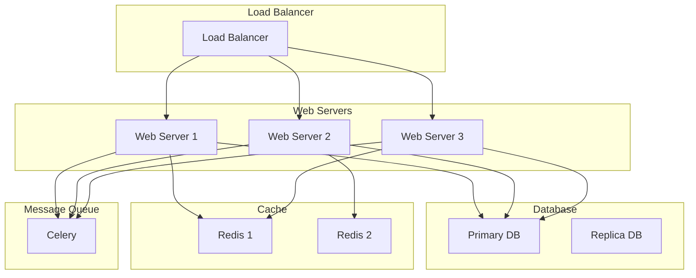

### 2. Вертикальное масштабирование

#### Оптимизация ресурсов:
- Увеличение RAM для кэширования
- Увеличение CPU для обработки запросов
- Оптимизация базы данных
- Использование SSD для быстрого доступа

### 3. Кэширование

#### Многоуровневое кэширование:
```python
# Уровень 1: Django кэш
from django.core.cache import cache

# Уровень 2: Redis
import redis
r = redis.Redis(host='localhost', port=6379, db=0)

# Уровень 3: CDN
# Статические файлы через CDN
```

---

## 🎉 Заключение

Архитектура приложения `accounts` построена на принципах:

1. **Модульности** - четкое разделение ответственности
2. **Масштабируемости** - легкое добавление новых функций
3. **Безопасности** - многоуровневая защита данных
4. **Производительности** - оптимизация запросов и кэширование
5. **Интегрируемости** - легкая интеграция с внешними сервисами

Система готова к production использованию и легко адаптируется под новые требования.

---

**Дата обновления:** 2024-01-20  
**Версия:** 1.0.0  
**Статус:** Production Ready ✅
