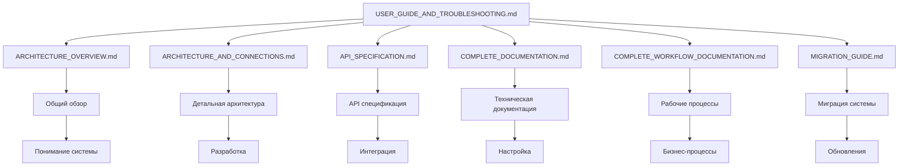

# Руководство пользователя и решение проблем приложения Accounts

## 🎯 Обзор

Данный документ содержит руководство для пользователей приложения `accounts`, описание потенциальных проблем, их решений и связей с остальной документацией системы.

---

## 📋 Содержание

1. [Руководство для новых пользователей](#руководство-для-новых-пользователей)
2. [Руководство для администраторов](#руководство-для-администраторов)
3. [Руководство для разработчиков](#руководство-для-разработчиков)
4. [Потенциальные проблемы и решения](#потенциальные-проблемы-и-решения)
5. [Связи с документацией](#связи-с-документацией)
6. [Часто задаваемые вопросы](#часто-задаваемые-вопросы)
7. [Контакты и поддержка](#контакты-и-поддержка)

---

## 👤 Руководство для новых пользователей

### 1. Первый вход в систему

#### 1.1 Регистрация через форму
```mermaid
graph TD
    A[Открыть сайт] --> B[Нажать "Регистрация"]
    B --> C[Заполнить форму]
    C --> D[Ввести email и пароль]
    D --> E[Подтвердить регистрацию]
    E --> F[Автоматически назначена роль "Наблюдатели"]
    F --> G[Войти в систему]
```

**Пошаговая инструкция:**
1. Откройте главную страницу системы
2. Нажмите кнопку "Регистрация" или "Создать аккаунт"
3. Заполните обязательные поля:
   - **Email** - ваш рабочий email
   - **Пароль** - надежный пароль (минимум 8 символов)
   - **Имя** и **Фамилия** - для отображения в системе
4. Нажмите "Создать аккаунт"
5. Проверьте email и подтвердите регистрацию
6. Войдите в систему с вашими учетными данными

#### 1.2 Регистрация через Google OAuth
```mermaid
graph TD
    A[Открыть сайт] --> B[Нажать "Войти через Google"]
    B --> C[Перенаправление на Google]
    C --> D[Авторизация в Google]
    D --> E[Подтверждение доступа]
    E --> F[Автоматическое создание аккаунта]
    F --> G[Назначение роли "Наблюдатели"]
    G --> H[Вход в систему]
```

**Пошаговая инструкция:**
1. Откройте главную страницу системы
2. Нажмите кнопку "Войти через Google"
3. Выберите Google аккаунт для входа
4. Подтвердите предоставление доступа к системе
5. Система автоматически создаст ваш аккаунт
6. Вы будете авторизованы в системе

### 2. Настройка профиля

#### 2.1 Основная информация
После входа в систему перейдите в раздел "Профиль":

1. **Личная информация:**
   - Обновите имя и фамилию
   - Добавьте полное имя (ФИО)
   - Укажите Telegram username (если есть)

2. **Контактная информация:**
   - Проверьте email адрес
   - Обновите при необходимости

#### 2.2 Настройка интеграций
В разделе "Интеграции" вы можете подключить внешние сервисы:

1. **Google OAuth:**
   - Нажмите "Подключить Google"
   - Авторизуйтесь в Google
   - Получите доступ к календарю и Drive

2. **API ключи:**
   - Gemini AI - для AI анализа
   - ClickUp - для управления задачами
   - Notion - для синхронизации данных
   - Huntflow - для работы с кандидатами

### 3. Понимание ролей

#### 3.1 Роль "Наблюдатели" (по умолчанию)
- **Права:** Только просмотр данных
- **Доступ:** Просмотр вакансий, кандидатов, интервью
- **Ограничения:** Не может редактировать данные

#### 3.2 Роль "Интервьюеры"
- **Права:** Просмотр + управление интервью
- **Доступ:** Календарь интервью, назначение встреч
- **Настройка:** Требуется календарь Google

#### 3.3 Роль "Рекрутеры"
- **Права:** Полное управление вакансиями и кандидатами
- **Доступ:** Создание вакансий, работа с кандидатами
- **Интеграции:** Huntflow, Gemini AI

#### 3.4 Роль "Администраторы"
- **Права:** Полный доступ ко всем функциям
- **Доступ:** Управление пользователями, настройки системы
- **Возможности:** Назначение ролей, управление интеграциями

---

## 👨‍💼 Руководство для администраторов

### 1. Управление пользователями

#### 1.1 Создание пользователей
```bash
# Через CLI команды
python manage.py create_user username email --role "Рекрутеры"
python manage.py create_user john john@example.com --password "secure123" --role "Администраторы"
```

**Через веб-интерфейс:**
1. Перейдите в админ-панель Django
2. Выберите "Пользователи" → "Добавить пользователя"
3. Заполните обязательные поля
4. Назначьте роль через группы
5. Сохраните пользователя

#### 1.2 Назначение ролей
```bash
# Через CLI команды
python manage.py assign_role username "Интервьюеры"
python manage.py assign_role username "Рекрутеры"
```

**Через веб-интерфейс:**
1. Откройте профиль пользователя
2. Перейдите в раздел "Группы"
3. Выберите нужную роль
4. Сохраните изменения

#### 1.3 Управление правами доступа
```bash
# Проверка ролей
python manage.py seed_roles --validate

# Статистика ролей
python manage.py seed_roles --stats
```

### 2. Мониторинг системы

#### 2.1 Статистика пользователей
```bash
# Общая статистика
python manage.py user_stats
```

**Метрики для отслеживания:**
- Общее количество пользователей
- Активные пользователи
- Распределение по ролям
- Активность интеграций

#### 2.2 Проверка интеграций
1. **Google OAuth:**
   - Проверьте токены в админ-панели
   - Убедитесь в корректности настроек

2. **API ключи:**
   - Тестируйте ключи через интерфейс
   - Мониторьте ошибки в логах

3. **Внешние сервисы:**
   - Проверяйте статус API
   - Отслеживайте лимиты запросов

### 3. Безопасность

#### 3.1 Управление паролями
- Требуйте смены паролей при первом входе
- Настройте политику сложности паролей
- Регулярно проверяйте активность пользователей

#### 3.2 API ключи
- Храните ключи в зашифрованном виде
- Регулярно ротируйте ключи
- Мониторьте использование API

#### 3.3 Аудит доступа
- Ведите логи входов в систему
- Отслеживайте изменения в данных
- Настройте уведомления о подозрительной активности

---

## 👨‍💻 Руководство для разработчиков

### 1. Настройка окружения

#### 1.1 Установка зависимостей
```bash
# Клонирование репозитория
git clone <repository_url>
cd hrhelper

# Создание виртуального окружения
python -m venv venv
source venv/bin/activate  # Linux/Mac
# или
venv\Scripts\activate  # Windows

# Установка зависимостей
pip install -r requirements.txt
```

#### 1.2 Настройка базы данных
```bash
# Применение миграций
python manage.py migrate

# Создание ролей
python manage.py seed_roles

# Создание суперпользователя
python manage.py createsuperuser
```

#### 1.3 Настройка внешних сервисов
1. **Google OAuth:**
   - Создайте проект в Google Cloud Console
   - Настройте OAuth 2.0 credentials
   - Добавьте redirect URIs

2. **API ключи:**
   - Получите ключи для всех сервисов
   - Настройте переменные окружения
   - Протестируйте подключения

### 2. Разработка

#### 2.1 Структура проекта
```
apps/accounts/
├── models.py              # Модели данных
├── views.py               # Веб-интерфейс
├── views_api.py           # REST API
├── forms.py               # Django формы
├── admin.py               # Админ-панель
├── urls.py                # URL маршруты
├── logic/                 # Сервисный слой
│   ├── user_service.py    # Бизнес-логика
│   ├── role_service.py    # Управление ролями
│   ├── oauth_service.py   # OAuth операции
│   ├── auth_adapters.py   # Адаптеры
│   ├── serializers.py     # API сериализаторы
│   └── signals.py         # Django сигналы
├── management/commands/   # CLI команды
└── migrations/            # Миграции БД
```

#### 2.2 Принципы разработки
- **SOLID принципы** - следование принципам объектно-ориентированного программирования
- **DRY** - не повторяй себя
- **Service Layer** - бизнес-логика в сервисах
- **API-first** - приоритет API над веб-интерфейсом

#### 2.3 Тестирование
```bash
# Запуск тестов
python manage.py test apps.accounts

# Проверка кода
python manage.py check

# Проверка миграций
python manage.py showmigrations
```

### 3. Развертывание

#### 3.1 Production настройки
```python
# settings.py
DEBUG = False
ALLOWED_HOSTS = ['yourdomain.com']

# База данных
DATABASES = {
    'default': {
        'ENGINE': 'django.db.backends.postgresql',
        'NAME': 'hrhelper_prod',
        'USER': 'hrhelper_user',
        'PASSWORD': 'secure_password',
        'HOST': 'localhost',
        'PORT': '5432',
    }
}

# Кэширование
CACHES = {
    'default': {
        'BACKEND': 'django_redis.cache.RedisCache',
        'LOCATION': 'redis://127.0.0.1:6379/1',
    }
}
```

#### 3.2 Мониторинг
- Настройте логирование
- Подключите Sentry для отслеживания ошибок
- Настройте метрики производительности
- Создайте дашборды мониторинга

---

## ⚠️ Потенциальные проблемы и решения

### 1. Проблемы аутентификации

#### 1.1 Ошибка "Invalid credentials"
**Симптомы:**
- Не удается войти в систему
- Сообщение "Неверное имя пользователя или пароль"

**Возможные причины:**
- Неправильный email или пароль
- Аккаунт деактивирован
- Проблемы с кодировкой пароля

**Решения:**
```bash
# Проверка пользователя
python manage.py shell
>>> from django.contrib.auth import get_user_model
>>> User = get_user_model()
>>> user = User.objects.get(email='user@example.com')
>>> print(user.is_active)  # Должно быть True
>>> user.check_password('password')  # Проверка пароля
```

#### 1.2 Проблемы с Google OAuth
**Симптомы:**
- Ошибка "State mismatch"
- Не удается авторизоваться через Google
- Ошибка "Invalid redirect URI"

**Возможные причины:**
- Неправильные настройки OAuth
- Проблемы с redirect URI
- Истекшие токены

**Решения:**
```bash
# Проверка настроек OAuth
python manage.py shell
>>> from django.conf import settings
>>> print(settings.SOCIALACCOUNT_PROVIDERS)

# Очистка сессии
python manage.py shell
>>> from django.contrib.sessions.models import Session
>>> Session.objects.all().delete()
```

### 2. Проблемы с API ключами

#### 2.1 API ключи не работают
**Симптомы:**
- Ошибки при тестировании API
- "API key invalid" или "Unauthorized"
- Таймауты при запросах

**Возможные причины:**
- Неправильный формат ключа
- Истекший ключ
- Превышение лимитов API
- Проблемы с сетью

**Решения:**
```bash
# Тестирование API ключей
curl -X POST http://localhost:8000/accounts/api/test-gemini/ \
  -H "Content-Type: application/json" \
  -d '{"api_key": "your_api_key"}'

# Проверка лимитов
# Обратитесь к документации соответствующего API
```

#### 2.2 Проблемы с Huntflow API
**Симптомы:**
- Ошибка "Invalid API key"
- "Rate limit exceeded"
- "Sandbox/Prod mismatch"

**Решения:**
1. Проверьте правильность API ключа
2. Убедитесь в корректности URL (sandbox/prod)
3. Проверьте лимиты запросов
4. Обновите ключ при необходимости

### 3. Проблемы с ролями и правами

#### 3.1 Роли не применяются
**Симптомы:**
- Пользователь не видит нужные функции
- Ошибка "Permission denied"
- Неправильные права доступа

**Возможные причины:**
- Роли не созданы в системе
- Пользователь не добавлен в группу
- Проблемы с кэшированием

**Решения:**
```bash
# Пересоздание ролей
python manage.py seed_roles

# Валидация ролей
python manage.py seed_roles --validate

# Проверка пользователя
python manage.py shell
>>> from django.contrib.auth import get_user_model
>>> User = get_user_model()
>>> user = User.objects.get(username='username')
>>> print(user.groups.all())
>>> print(user.is_admin, user.is_recruiter, user.is_interviewer, user.is_observer)
```

#### 3.2 Проблемы с правами доступа
**Симптомы:**
- 403 Forbidden ошибки
- Недоступные функции
- Ошибки авторизации

**Решения:**
1. Проверьте назначение ролей
2. Убедитесь в корректности прав группы
3. Очистите кэш сессий
4. Перезапустите сервер

### 4. Проблемы производительности

#### 4.1 Медленная работа системы
**Симптомы:**
- Долгая загрузка страниц
- Таймауты запросов
- Высокая нагрузка на сервер

**Возможные причины:**
- N+1 запросы к базе данных
- Отсутствие кэширования
- Неоптимизированные запросы
- Проблемы с внешними API

**Решения:**
```python
# Оптимизация запросов
users = User.objects.select_related('groups').prefetch_related('groups__permissions')

# Кэширование
from django.core.cache import cache
cache.set('user_stats', stats, 300)

# Мониторинг
# Используйте Django Debug Toolbar для анализа запросов
```

#### 4.2 Проблемы с памятью
**Симптомы:**
- Высокое потребление RAM
- Медленная работа системы
- Ошибки "Out of memory"

**Решения:**
1. Оптимизируйте запросы к БД
2. Настройте кэширование
3. Увеличьте RAM сервера
4. Используйте пагинацию для больших списков

### 5. Проблемы интеграций

#### 5.1 Проблемы с Google Calendar
**Симптомы:**
- Не синхронизируется календарь
- Ошибки при создании событий
- Проблемы с правами доступа

**Решения:**
1. Проверьте OAuth токены
2. Убедитесь в корректности scopes
3. Обновите токены при необходимости
4. Проверьте права доступа к календарю

#### 5.2 Проблемы с Telegram ботом
**Симптомы:**
- Не приходят уведомления
- Ошибки авторизации
- Проблемы с webhook

**Решения:**
```bash
# Проверка бота
python manage.py shell
>>> from apps.telegram.models import TelegramUser
>>> for user in TelegramUser.objects.all():
...     print(f"{user.user.username}: {user.is_authorized}")

# Перезапуск бота
python manage.py runbot
```

---

## 📚 Связи с документацией

### 1. Архитектурная документация

#### 1.1 [ARCHITECTURE_OVERVIEW.md](./ARCHITECTURE_OVERVIEW.md)
**Связь:** Общий обзор архитектуры системы
**Использование:** 
- Понимание структуры приложения
- Связи между компонентами
- Паттерны архитектуры

**Ключевые разделы:**
- Структура приложения Accounts
- URL маршруты и представления
- Связи с другими приложениями
- Метрики архитектуры

#### 1.2 [ARCHITECTURE_AND_CONNECTIONS.md](./ARCHITECTURE_AND_CONNECTIONS.md)
**Связь:** Детальная архитектура и связи
**Использование:**
- Глубокое понимание архитектуры
- Принципы SOLID
- Модели данных и связи

**Ключевые разделы:**
- Принципы архитектуры
- Сервисный слой
- API архитектура
- Безопасность и производительность

### 2. Техническая документация

#### 2.1 [API_SPECIFICATION.md](./API_SPECIFICATION.md)
**Связь:** Полная спецификация API
**Использование:**
- Разработка клиентских приложений
- Интеграция с внешними системами
- Тестирование API

**Ключевые разделы:**
- REST API Endpoints
- JSON API Endpoints
- Модели данных и сериализаторы
- Примеры использования

#### 2.2 [COMPLETE_DOCUMENTATION.md](./COMPLETE_DOCUMENTATION.md)
**Связь:** Полная техническая документация
**Использование:**
- Справочник по всем функциям
- Настройка и развертывание
- Troubleshooting

**Ключевые разделы:**
- Модели и API
- Сервисный слой
- OAuth интеграция
- CLI команды

### 3. Рабочие процессы

#### 3.1 [COMPLETE_WORKFLOW_DOCUMENTATION.md](./COMPLETE_WORKFLOW_DOCUMENTATION.md)
**Связь:** Рабочие процессы и взаимодействия
**Использование:**
- Понимание бизнес-процессов
- Интеграция с внешними сервисами
- Мониторинг и логирование

**Ключевые разделы:**
- Рабочие процессы
- Взаимодействия с другими приложениями
- Архитектурные решения
- Безопасность и производительность

#### 3.2 [MIGRATION_GUIDE.md](./MIGRATION_GUIDE.md)
**Связь:** Руководство по миграции
**Использование:**
- Обновление системы
- Рефакторинг кода
- Миграция данных

**Ключевые разделы:**
- План миграции (3 этапа)
- Создание сервисного слоя
- Рефакторинг views
- CLI команды и оптимизация

### 4. Схема связей документации



---

## ❓ Часто задаваемые вопросы

### 1. Общие вопросы

#### Q: Как создать нового пользователя?
**A:** Используйте CLI команду:
```bash
python manage.py create_user username email --role "Рекрутеры"
```
Или через админ-панель Django.

#### Q: Как назначить роль пользователю?
**A:** Используйте CLI команду:
```bash
python manage.py assign_role username "Интервьюеры"
```
Или через веб-интерфейс в разделе "Группы".

#### Q: Как проверить статус системы?
**A:** Используйте команды:
```bash
python manage.py check
python manage.py seed_roles --validate
python manage.py user_stats
```

### 2. Проблемы с интеграциями

#### Q: Не работает Google OAuth, что делать?
**A:** Проверьте:
1. Настройки OAuth в Google Cloud Console
2. Redirect URIs
3. Токены в админ-панели
4. Логи системы

#### Q: API ключи не работают, как исправить?
**A:** Выполните:
1. Проверьте формат ключей
2. Протестируйте через интерфейс
3. Проверьте лимиты API
4. Обновите ключи при необходимости

#### Q: Не синхронизируется календарь Google?
**A:** Убедитесь:
1. OAuth токены действительны
2. Права доступа к календарю
3. Корректность scopes
4. Настройки календаря пользователя

### 3. Проблемы с правами

#### Q: Пользователь не видит нужные функции?
**A:** Проверьте:
1. Назначение ролей
2. Права группы
3. Кэш сессий
4. Статус пользователя

#### Q: Ошибка "Permission denied"?
**A:** Выполните:
1. Проверьте роли пользователя
2. Убедитесь в корректности прав
3. Очистите кэш
4. Перезапустите сервер

### 4. Технические вопросы

#### Q: Как оптимизировать производительность?
**A:** Используйте:
1. `select_related()` и `prefetch_related()`
2. Кэширование данных
3. Индексы базы данных
4. Мониторинг запросов

#### Q: Как настроить мониторинг?
**A:** Настройте:
1. Логирование Django
2. Sentry для ошибок
3. Prometheus для метрик
4. Grafana для визуализации

---

## 📞 Контакты и поддержка

### 1. Техническая поддержка

#### 1.1 Внутренняя поддержка
- **Email:** support@hrhelper.com
- **Slack:** #hrhelper-support
- **Документация:** Внутренняя wiki

#### 1.2 Экстренная поддержка
- **Телефон:** +7 (XXX) XXX-XX-XX
- **Telegram:** @hrhelper_support
- **Время работы:** 24/7 для критических проблем

### 2. Документация и ресурсы

#### 2.1 Внутренние ресурсы
- **Документация:** `/docs/` директория
- **API документация:** Swagger UI
- **База знаний:** Confluence
- **Код:** GitLab/GitHub

#### 2.2 Внешние ресурсы
- **Django документация:** https://docs.djangoproject.com/
- **DRF документация:** https://www.django-rest-framework.org/
- **Google OAuth:** https://developers.google.com/identity/protocols/oauth2

### 3. Процедуры эскалации

#### 3.1 Уровни поддержки
1. **L1 - Базовая поддержка:**
   - Решение простых проблем
   - Консультации по использованию
   - Первичная диагностика

2. **L2 - Техническая поддержка:**
   - Сложные технические проблемы
   - Интеграции и API
   - Производительность

3. **L3 - Разработка:**
   - Критические баги
   - Архитектурные изменения
   - Новые функции

#### 3.2 Время реакции
- **Критические проблемы:** 1 час
- **Высокий приоритет:** 4 часа
- **Средний приоритет:** 1 рабочий день
- **Низкий приоритет:** 3 рабочих дня

---

## 🎉 Заключение

Данное руководство предоставляет:

1. **Полное руководство** для всех типов пользователей
2. **Детальное описание проблем** и их решений
3. **Связи с документацией** для глубокого изучения
4. **FAQ** для быстрого решения вопросов
5. **Контакты поддержки** для получения помощи

**Система готова к использованию** и имеет все необходимые ресурсы для эффективной работы и поддержки.

---

**Дата обновления:** 2024-01-20  
**Версия:** 1.0.0  
**Статус:** Production Ready ✅
