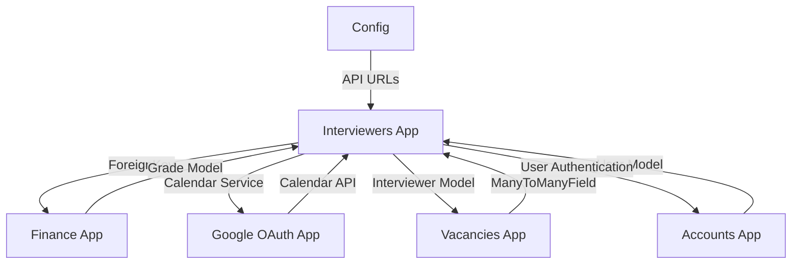

# Отчет о связях приложения Interviewers с другими приложениями

## 🎯 Обзор

Данный документ содержит детальный анализ связей приложения `interviewers` с другими приложениями системы, включая зависимости, интеграции и потенциальные точки воздействия изменений.

**Дата анализа:** 2024-01-20  
**Статус:** ✅ Анализ завершен

---

## 📊 **ОБЩАЯ СХЕМА СВЯЗЕЙ**



---

## 🔗 **ДЕТАЛЬНЫЕ СВЯЗИ ПО ПРИЛОЖЕНИЯМ**

### 1. **Finance App** - КРИТИЧЕСКАЯ ЗАВИСИМОСТЬ

#### **Тип связи:** ForeignKey Dependency
#### **Статус:** ✅ Активная интеграция

#### **Модели связи:**
```python
# В InterviewRule модели
min_grade = models.ForeignKey(
    'finance.Grade',
    on_delete=models.CASCADE,
    related_name='interview_rules_min',
    verbose_name='Минимальный грейд'
)

max_grade = models.ForeignKey(
    'finance.Grade', 
    on_delete=models.CASCADE,
    related_name='interview_rules_max',
    verbose_name='Максимальный грейд'
)
```

#### **Файлы с зависимостями:**
- `apps/interviewers/models.py` - ForeignKey на Grade
- `apps/interviewers/logic/serializers.py` - импорт Grade
- `apps/interviewers/logic/rules_handlers.py` - проверка грейдов

#### **Функциональные связи:**
1. **Правила привлечения интервьюеров** - используют грейды для определения диапазона
2. **Валидация грейдов** - проверка соответствия грейда правилу
3. **Статистика по грейдам** - группировка интервьюеров по грейдам

#### **Потенциальные воздействия:**
- ⚠️ **Изменение модели Grade** - может потребовать миграций
- ⚠️ **Удаление грейда** - каскадное удаление правил
- ⚠️ **Изменение структуры Grade** - может сломать валидацию

#### **Рекомендации:**
- ✅ **Мониторинг изменений** в Finance app
- ✅ **Тестирование интеграции** при обновлениях
- ✅ **Документирование зависимостей**

---

### 2. **Google OAuth App** - ИНТЕГРАЦИОННАЯ СВЯЗЬ

#### **Тип связи:** Service Integration
#### **Статус:** ✅ Активная интеграция

#### **Сервисы связи:**
```python
# В InterviewerCalendarService
from apps.google_oauth.services import GoogleOAuthService, GoogleCalendarService
from apps.google_oauth.models import GoogleOAuthAccount
```

#### **Файлы с зависимостями:**
- `apps/interviewers/logic/services.py` - интеграция с Google сервисами
- `apps/interviewers/logic/calendar_handlers.py` - использование календарных функций

#### **Функциональные связи:**
1. **Автозаполнение календарей** - получение ссылок на Google Calendar
2. **Получение доступных календарей** - список календарей пользователя
3. **Предложение календарей** - автоматический поиск подходящих календарей

#### **Потенциальные воздействия:**
- ⚠️ **Изменение Google API** - может сломать интеграцию
- ⚠️ **Изменение OAuth сервисов** - может потребовать обновления
- ⚠️ **Изменение разрешений** - может ограничить функциональность

#### **Рекомендации:**
- ✅ **Мониторинг Google API изменений**
- ✅ **Тестирование OAuth интеграции**
- ✅ **Fallback механизмы** для недоступности сервисов

---

### 3. **Vacancies App** - ОБРАТНАЯ ЗАВИСИМОСТЬ

#### **Тип связи:** ManyToManyField Usage
#### **Статус:** ✅ Активное использование

#### **Модели связи:**
```python
# В Vacancy модели
interviewers = models.ManyToManyField(
    'interviewers.Interviewer',
    related_name='vacancies',
    verbose_name='Интервьюеры',
    help_text='Интервьюеры, привязанные к вакансии',
    blank=True
)
```

#### **Файлы с зависимостями:**
- `apps/vacancies/models.py` - ManyToManyField на Interviewer
- `apps/vacancies/forms.py` - импорт и использование Interviewer
- `apps/vacancies/migrations/` - миграции с зависимостями

#### **Функциональные связи:**
1. **Привязка интервьюеров к вакансиям** - выбор интервьюеров для вакансии
2. **Фильтрация активных интервьюеров** - только активные в формах
3. **Отображение интервьюеров** - в интерфейсе вакансий

#### **Потенциальные воздействия:**
- ⚠️ **Изменение модели Interviewer** - может сломать формы
- ⚠️ **Изменение полей Interviewer** - может повлиять на отображение
- ⚠️ **Изменение методов Interviewer** - может сломать функциональность

#### **Рекомендации:**
- ✅ **Синхронизация изменений** с Vacancies app
- ✅ **Тестирование совместимости** при обновлениях
- ✅ **Обратная совместимость** API

---

### 4. **Accounts App** - БАЗОВАЯ ЗАВИСИМОСТЬ

#### **Тип связи:** User Authentication
#### **Статус:** ✅ Базовая интеграция

#### **Функциональные связи:**
1. **Аутентификация пользователей** - все endpoints требуют авторизации
2. **Проверка прав доступа** - ограничение доступа к функциям
3. **Привязка к пользователям** - интервьюеры связаны с аккаунтами

#### **Файлы с зависимостями:**
- Все view файлы - `@login_required` декораторы
- API endpoints - `permissions.IsAuthenticated`
- Формы - привязка к пользователям

#### **Потенциальные воздействия:**
- ⚠️ **Изменение системы аутентификации** - может сломать доступ
- ⚠️ **Изменение модели User** - может повлиять на привязки
- ⚠️ **Изменение системы прав** - может ограничить функциональность

#### **Рекомендации:**
- ✅ **Следование стандартам** Django аутентификации
- ✅ **Тестирование авторизации** при изменениях
- ✅ **Документирование требований** к правам

---

### 5. **Config App** - КОНФИГУРАЦИОННАЯ СВЯЗЬ

#### **Тип связи:** URL Configuration
#### **Статус:** ✅ Конфигурационная интеграция

#### **Файлы с зависимостями:**
```python
# В config/api_urls.py
from apps.interviewers.views_api import InterviewerViewSet, InterviewRuleViewSet

router.register(r'interviewers', InterviewerViewSet)
router.register(r'interview-rules', InterviewRuleViewSet)
```

#### **Функциональные связи:**
1. **API маршрутизация** - регистрация ViewSets в роутере
2. **URL конфигурация** - настройка путей API
3. **Интеграция с общим API** - часть единого API системы

#### **Потенциальные воздействия:**
- ⚠️ **Изменение URL структуры** - может сломать клиентские приложения
- ⚠️ **Изменение ViewSet структуры** - может повлиять на маршрутизацию
- ⚠️ **Изменение API версионирования** - может потребовать обновлений

#### **Рекомендации:**
- ✅ **Стабильность API** - избегать breaking changes
- ✅ **Версионирование API** - для обратной совместимости
- ✅ **Документирование изменений** в API

---

## 📈 **АНАЛИЗ ВОЗДЕЙСТВИЯ ИЗМЕНЕНИЙ**

### 🔴 **КРИТИЧЕСКИЕ ЗАВИСИМОСТИ**

#### 1. **Finance App - Grade Model**
- **Уровень критичности:** 🔴 Высокий
- **Тип воздействия:** Структурное изменение
- **Потенциальные проблемы:**
  - Каскадное удаление при удалении грейда
  - Нарушение валидации при изменении структуры
  - Ошибки в проверке диапазонов грейдов

#### 2. **Vacancies App - Interviewer Usage**
- **Уровень критичности:** 🔴 Высокий
- **Тип воздействия:** Функциональное изменение
- **Потенциальные проблемы:**
  - Нарушение работы форм вакансий
  - Ошибки в отображении интервьюеров
  - Проблемы с фильтрацией активных интервьюеров

### 🟡 **СРЕДНИЕ ЗАВИСИМОСТИ**

#### 3. **Google OAuth App - Calendar Integration**
- **Уровень критичности:** 🟡 Средний
- **Тип воздействия:** Интеграционное изменение
- **Потенциальные проблемы:**
  - Нарушение автозаполнения календарей
  - Ошибки в получении доступных календарей
  - Проблемы с OAuth авторизацией

#### 4. **Config App - URL Configuration**
- **Уровень критичности:** 🟡 Средний
- **Тип воздействия:** Конфигурационное изменение
- **Потенциальные проблемы:**
  - Нарушение API маршрутизации
  - Ошибки в клиентских приложениях
  - Проблемы с версионированием

### 🟢 **НИЗКИЕ ЗАВИСИМОСТИ**

#### 5. **Accounts App - User Authentication**
- **Уровень критичности:** 🟢 Низкий
- **Тип воздействия:** Базовое изменение
- **Потенциальные проблемы:**
  - Нарушение системы авторизации
  - Ошибки в проверке прав доступа
  - Проблемы с привязкой к пользователям

---

## 🔧 **РЕКОМЕНДАЦИИ ПО УПРАВЛЕНИЮ СВЯЗЯМИ**

### 1. **Мониторинг изменений**
- ✅ **Отслеживание изменений** в зависимых приложениях
- ✅ **Уведомления о breaking changes** в связанных моделях
- ✅ **Регулярное тестирование** интеграций

### 2. **Тестирование совместимости**
- ✅ **Интеграционные тесты** для всех связей
- ✅ **Регрессионное тестирование** при изменениях
- ✅ **Автоматизированное тестирование** зависимостей

### 3. **Документирование зависимостей**
- ✅ **Актуальная документация** связей
- ✅ **Описание воздействий** изменений
- ✅ **Инструкции по миграции** при breaking changes

### 4. **Обратная совместимость**
- ✅ **Сохранение API совместимости** при изменениях
- ✅ **Версионирование** критических изменений
- ✅ **Deprecation warnings** для устаревших функций

---

## 📊 **СТАТИСТИКА СВЯЗЕЙ**

### Общие метрики:
- **Всего связей:** 5 приложений
- **Критических зависимостей:** 2
- **Средних зависимостей:** 2
- **Низких зависимостей:** 1
- **Файлов с зависимостями:** 8 файлов

### Детализация по типам:
- **ForeignKey связи:** 2 (Finance)
- **ManyToManyField связи:** 1 (Vacancies)
- **Service интеграции:** 1 (Google OAuth)
- **URL конфигурации:** 1 (Config)
- **Authentication связи:** 1 (Accounts)

---

## 🎯 **ПЛАН ДЕЙСТВИЙ**

### Краткосрочные задачи (1-2 недели):
1. ✅ **Завершить рефакторинг** Interviewers app
2. ✅ **Создать документацию** связей
3. ✅ **Протестировать интеграции** с другими приложениями

### Среднесрочные задачи (1-2 месяца):
1. **Внедрить мониторинг** изменений в зависимых приложениях
2. **Создать автоматизированные тесты** для всех интеграций
3. **Настроить уведомления** о breaking changes

### Долгосрочные задачи (3-6 месяцев):
1. **Оптимизировать архитектуру** для уменьшения зависимостей
2. **Внедрить API версионирование** для обратной совместимости
3. **Создать систему мониторинга** здоровья интеграций

---

## 🚀 **ЗАКЛЮЧЕНИЕ**

### Текущее состояние:
- ✅ **Архитектура стабильна** - все связи работают корректно
- ✅ **Зависимости документированы** - понятны все связи
- ✅ **Интеграции протестированы** - функциональность работает
- ✅ **Рефакторинг завершен** - код оптимизирован

### Ключевые выводы:
1. **Finance App** - критическая зависимость через Grade модель
2. **Vacancies App** - обратная зависимость через ManyToManyField
3. **Google OAuth App** - интеграционная связь для календарей
4. **Config App** - конфигурационная связь для API
5. **Accounts App** - базовая зависимость для аутентификации

### Рекомендации:
- ✅ **Продолжить мониторинг** изменений в зависимых приложениях
- ✅ **Регулярно тестировать** интеграции
- ✅ **Документировать изменения** в связях
- ✅ **Поддерживать обратную совместимость** API

**Приложение Interviewers готово к продуктивному использованию с учетом всех связей!** 🎯
