# Accounts App - Архитектурная схема и особенности

## 🎯 Обзор

Детальная архитектурная схема приложения `accounts` с описанием особенностей, логики работы, компонентов и их взаимодействий.

---

## 📋 Содержание

1. [Архитектурная схема](#архитектурная-схема)
2. [Особенности приложения](#особенности-приложения)
3. [Логика работы](#логика-работы)
4. [Компоненты системы](#компоненты-системы)
5. [Потоки данных](#потоки-данных)
6. [Интеграции](#интеграции)
7. [Безопасность](#безопасность)
8. [Производительность](#производительность)

---

## 🏗️ Архитектурная схема

### Общая архитектура системы

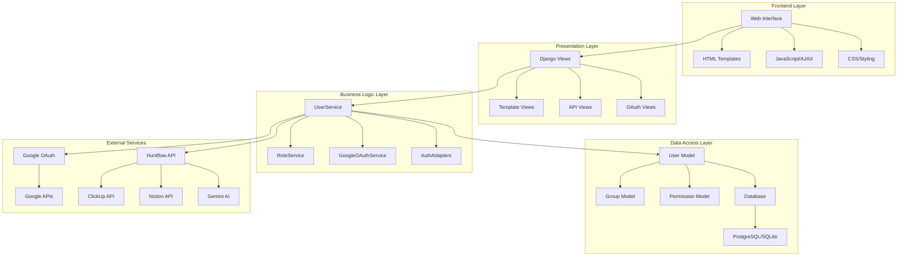

### Детальная архитектура компонентов

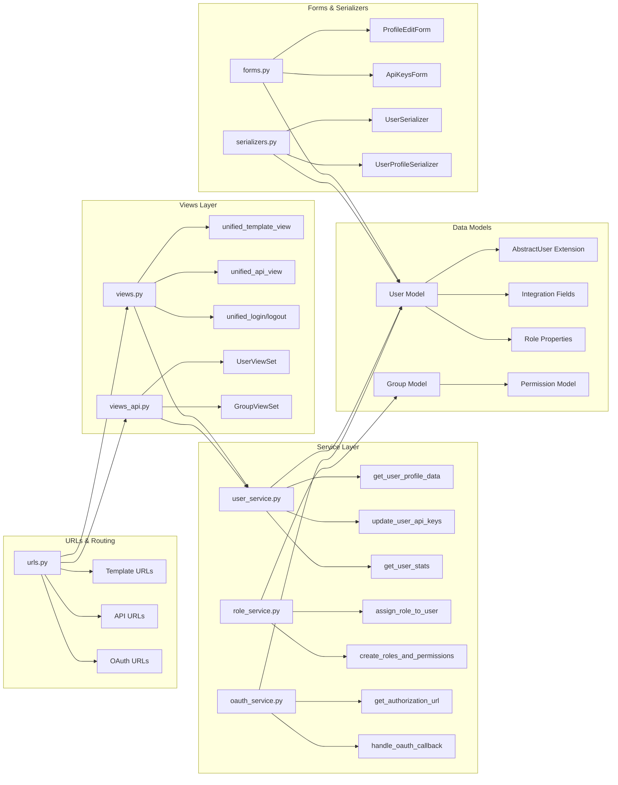

---

## ✨ Особенности приложения

### 1. Универсальная архитектура

#### Универсальные функции
- **`unified_template_view`** - единая функция для рендеринга HTML шаблонов
- **`unified_api_view`** - единая функция для обработки JSON API запросов
- **`unified_login/logout`** - универсальная аутентификация для HTML и JSON

#### Преимущества:
- ✅ **DRY принцип** - отсутствие дублирования кода
- ✅ **Консистентность** - единообразный интерфейс
- ✅ **Гибкость** - поддержка HTML и JSON форматов
- ✅ **Масштабируемость** - легко добавлять новые endpoints

### 2. Сервисный слой (Service Layer)

#### Принципы SOLID:
- **Single Responsibility** - каждый сервис отвечает за одну область
- **Open/Closed** - открыт для расширения, закрыт для модификации
- **Dependency Inversion** - зависимость от абстракций, не от конкретных реализаций

#### Сервисы:
```python
# UserService - управление пользователями
class UserService:
    @staticmethod
    def get_user_profile_data(user)
    @staticmethod
    def update_user_api_keys(user, data)
    @staticmethod
    def get_user_stats()

# RoleService - управление ролями
class RoleService:
    @staticmethod
    def assign_role_to_user(user, role_name)
    @staticmethod
    def create_roles_and_permissions()

# GoogleOAuthService - OAuth интеграция
class GoogleOAuthService:
    @staticmethod
    def get_authorization_url(request)
    @staticmethod
    def handle_oauth_callback(request)
```

### 3. Система ролей

#### Роли и права доступа:
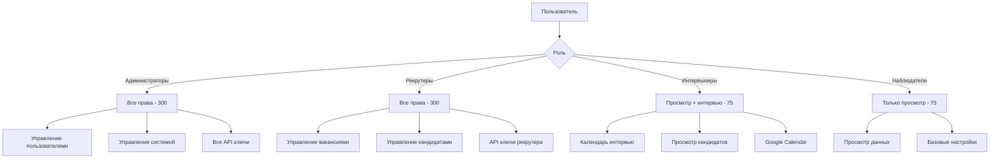

### 4. Интеграции с внешними сервисами

#### Поддерживаемые интеграции:
- **Google OAuth 2.0** - авторизация и доступ к Google сервисам
- **Gemini AI** - AI анализ и генерация контента
- **Huntflow** - управление вакансиями и кандидатами
- **ClickUp** - управление задачами
- **Notion** - синхронизация данных
- **Telegram** - уведомления и бот-команды

#### Архитектура интеграций:
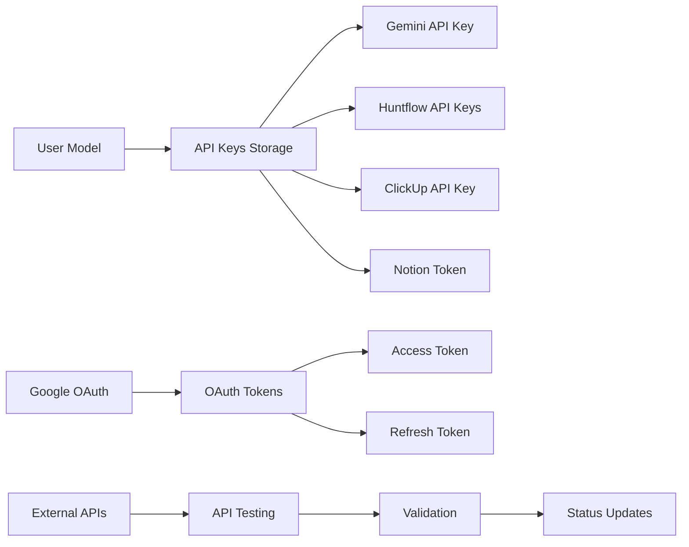

---

## 🔄 Логика работы

### 1. Процесс аутентификации

#### Стандартная аутентификация:
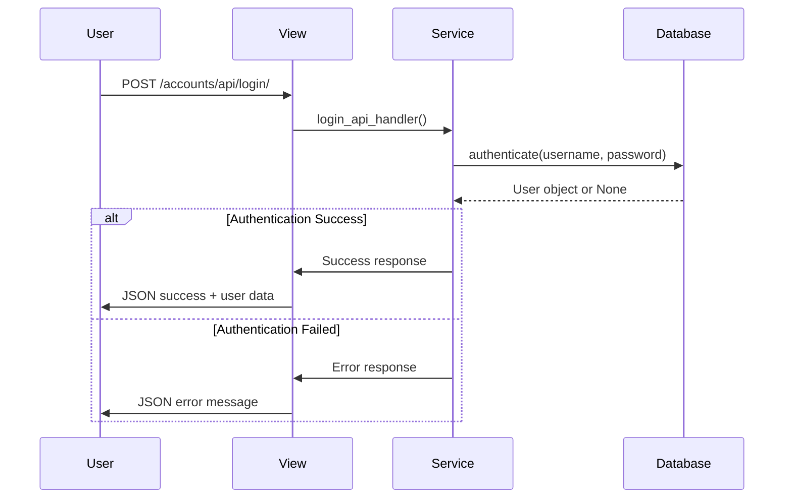

#### Google OAuth аутентификация:
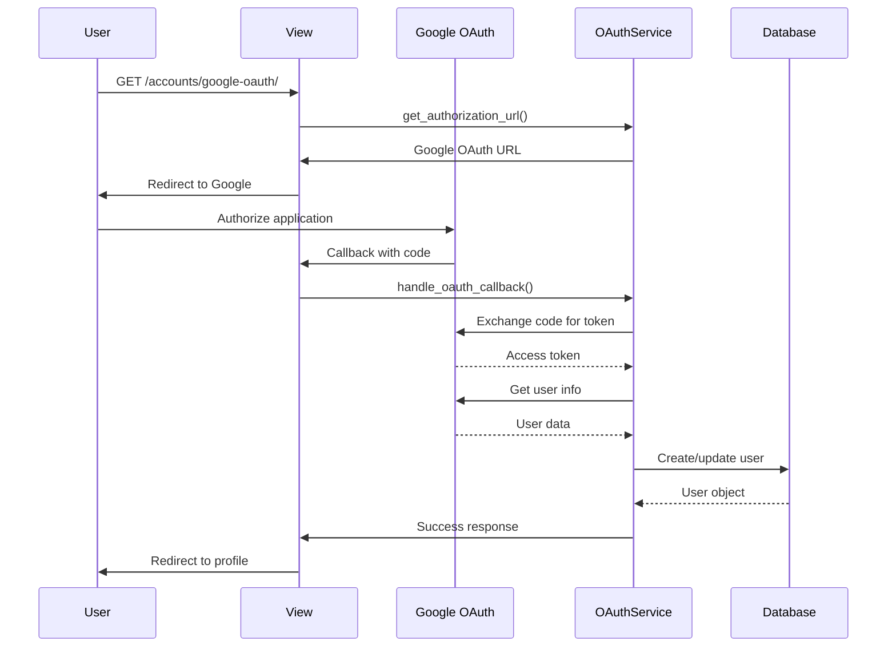

### 2. Управление ролями

#### Назначение роли:
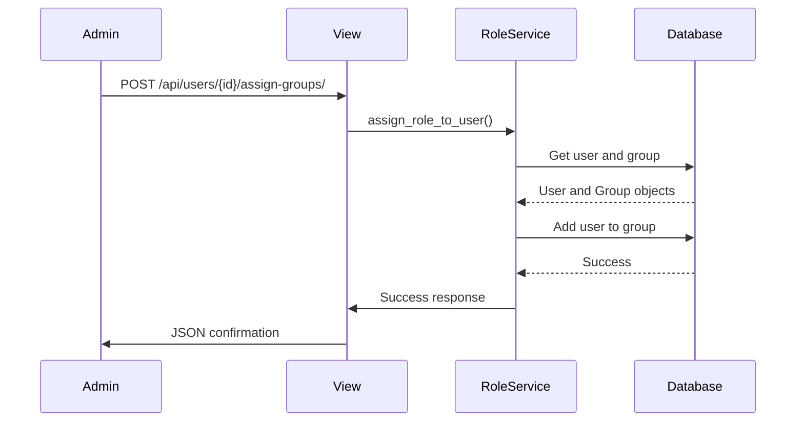

### 3. Управление API ключами

#### Обновление API ключей:
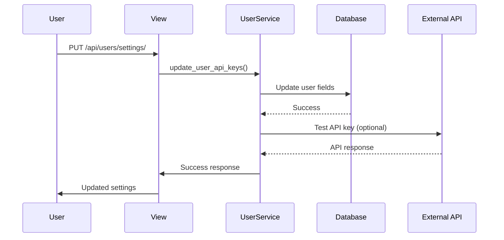

---

## 🧩 Компоненты системы

### 1. Модели данных

#### User Model (расширенная AbstractUser):
```python
class User(AbstractUser):
    # Основные поля
    full_name = models.CharField(max_length=255, blank=True)
    telegram_username = models.CharField(max_length=64, blank=True)
    
    # Интеграции
    gemini_api_key = models.CharField(max_length=256, blank=True)
    clickup_api_key = models.CharField(max_length=256, blank=True)
    notion_integration_token = models.CharField(max_length=256, blank=True)
    huntflow_prod_url = models.URLField(blank=True)
    huntflow_prod_api_key = models.CharField(max_length=256, blank=True)
    huntflow_sandbox_url = models.URLField(blank=True)
    huntflow_sandbox_api_key = models.CharField(max_length=256, blank=True)
    active_system = models.CharField(choices=SystemChoice.choices, default=SystemChoice.SANDBOX)
    
    # Роли
    interviewer_calendar_url = models.URLField(blank=True)
    is_observer_active = models.BooleanField(default=False)
    
    # Свойства ролей
    @property
    def is_admin(self) -> bool:
        return self.is_superuser or self.groups.filter(name="Администраторы").exists()
    
    @property
    def is_recruiter(self) -> bool:
        return self.groups.filter(name="Рекрутеры").exists()
    
    @property
    def is_interviewer(self) -> bool:
        return self.groups.filter(name="Интервьюеры").exists()
    
    @property
    def is_observer(self) -> bool:
        return self.groups.filter(name="Наблюдатели").exists()
```

### 2. Сервисный слой

#### UserService:
```python
class UserService:
    @staticmethod
    def get_user_profile_data(user):
        """Получение данных профиля пользователя"""
        return {
            'user': user,
            'integrations_status': UserService.get_integrations_status(user),
            'roles': [group.name for group in user.groups.all()],
            'permissions': user.get_all_permissions()
        }
    
    @staticmethod
    def update_user_api_keys(user, data):
        """Обновление API ключей пользователя"""
        for field in ['gemini_api_key', 'clickup_api_key', 'notion_integration_token',
                     'huntflow_prod_api_key', 'huntflow_sandbox_api_key']:
            if field in data:
                setattr(user, field, data[field])
        user.save()
    
    @staticmethod
    def get_user_stats():
        """Статистика пользователей"""
        return {
            'total_users': User.objects.count(),
            'active_users': User.objects.filter(is_active=True).count(),
            'staff_users': User.objects.filter(is_staff=True).count(),
            'groups_stats': {
                group.name: group.user_set.count()
                for group in Group.objects.all()
            }
        }
```

#### RoleService:
```python
class RoleService:
    ROLE_NAMES = ["Администраторы", "Наблюдатели", "Рекрутеры", "Интервьюеры"]
    
    @staticmethod
    def assign_role_to_user(user, role_name):
        """Назначение роли пользователю"""
        try:
            group = Group.objects.get(name=role_name)
            user.groups.add(group)
            return True
        except Group.DoesNotExist:
            return False
    
    @staticmethod
    def create_roles_and_permissions():
        """Создание ролей и назначение прав"""
        for role_name in RoleService.ROLE_NAMES:
            group, created = Group.objects.get_or_create(name=role_name)
            if created:
                # Назначение прав в зависимости от роли
                if role_name in ["Администраторы", "Рекрутеры"]:
                    # Все права
                    permissions = Permission.objects.all()
                else:
                    # Только просмотр
                    permissions = Permission.objects.filter(codename__startswith='view_')
                
                group.permissions.set(permissions)
```

### 3. Представления (Views)

#### Универсальные функции:
```python
def unified_template_view(request, template_name, handler_func=None, context=None):
    """Универсальная функция для рендеринга HTML-шаблонов"""
    if context is None:
        context = {}
    
    if handler_func:
        try:
            handler_context = handler_func(request)
            if isinstance(handler_context, dict):
                context.update(handler_context)
        except Exception as e:
            context['error'] = f'Ошибка обработки: {str(e)}'
    
    return render(request, template_name, context)

@csrf_exempt
def unified_api_view(request, handler_func):
    """Универсальная функция для обработки JSON API запросов"""
    if request.method != 'POST':
        return HttpResponseNotAllowed(['POST'])
    
    try:
        data = json.loads(request.body.decode('utf-8'))
    except json.JSONDecodeError:
        return JsonResponse({'error': 'Invalid JSON'}, status=400)
    
    response_data = handler_func(data, request)
    return JsonResponse(response_data)
```

---

## 📊 Потоки данных

### 1. Поток создания пользователя

```mermaid
flowchart TD
    A[Запрос создания пользователя] --> B{Валидация данных}
    B -->|Успех| C[UserService.create_user_with_observer_role]
    B -->|Ошибка| D[Возврат ошибок валидации]
    
    C --> E[Создание User объекта]
    E --> F[Назначение роли "Наблюдатели"]
    F --> G[Сохранение в БД]
    G --> H[Отправка сигналов]
    H --> I[Возврат созданного пользователя]
    
    D --> J[Клиент получает ошибки]
    I --> K[Клиент получает пользователя]
```

### 2. Поток аутентификации

```mermaid
flowchart TD
    A[Запрос аутентификации] --> B{Тип аутентификации}
    
    B -->|Стандартная| C[login_api_handler]
    B -->|Google OAuth| D[google_oauth_redirect]
    
    C --> E[authenticate(username, password)]
    E --> F{Успех?}
    F -->|Да| G[login(request, user)]
    F -->|Нет| H[Ошибка аутентификации]
    
    D --> I[Генерация state parameter]
    I --> J[Перенаправление на Google]
    J --> K[Google OAuth callback]
    K --> L[handle_oauth_callback]
    L --> M[Обмен кода на токен]
    M --> N[Получение данных пользователя]
    N --> O[Создание/поиск пользователя]
    O --> P[Авторизация в системе]
    
    G --> Q[Успешная авторизация]
    H --> R[Ошибка авторизации]
    P --> Q
```

### 3. Поток управления ролями

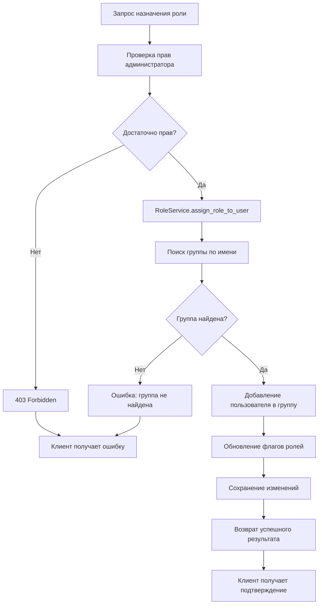

---

## 🔗 Интеграции

### 1. Google OAuth интеграция

#### Архитектура:
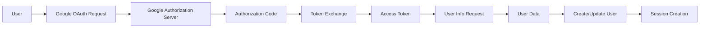

#### Компоненты:
- **GoogleOAuthService** - основной сервис для работы с OAuth
- **CustomSocialAccountAdapter** - адаптер для allauth
- **OAuth URLs** - маршруты для OAuth flow
- **Token Management** - управление токенами доступа

### 2. API ключи интеграции

#### Управление API ключами:
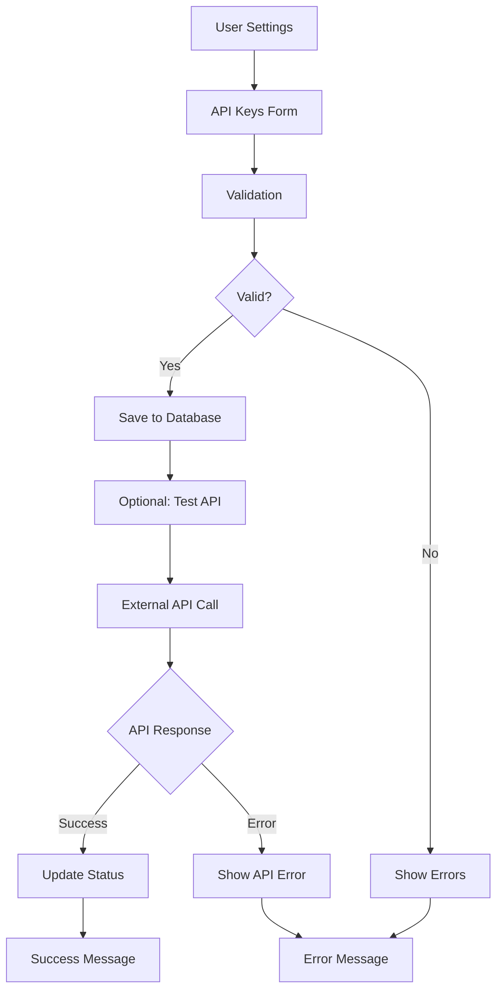

#### Поддерживаемые API:
- **Gemini AI** - для AI анализа и генерации
- **Huntflow** - для управления вакансиями (prod/sandbox)
- **ClickUp** - для управления задачами
- **Notion** - для синхронизации данных

---

## 🔒 Безопасность

### 1. Аутентификация

#### Методы аутентификации:
- **Session Authentication** - стандартная Django аутентификация
- **Google OAuth 2.0** - социальная авторизация
- **CSRF Protection** - защита от CSRF атак
- **State Parameter** - защита OAuth flow

#### Безопасность паролей:
- **Хеширование** - Django PBKDF2 с SHA256
- **Валидация** - проверка сложности паролей
- **Защита от брутфорса** - ограничение попыток входа

### 2. Авторизация

#### Система ролей:
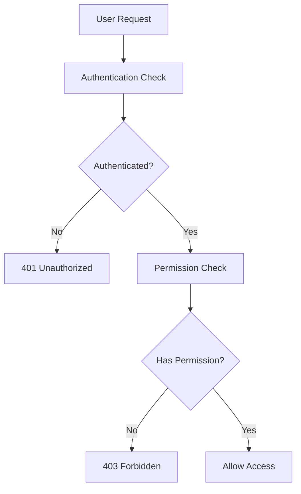

#### Контроль доступа:
- **Role-Based Access Control** - контроль на основе ролей
- **Permission Checks** - проверка прав на уровне API
- **Data Filtering** - фильтрация данных по ролям

### 3. Защита данных

#### API ключи:
- **Шифрование** - хранение в зашифрованном виде
- **Валидация** - проверка через тестовые запросы
- **Ротация** - регулярное обновление ключей

#### Валидация данных:
- **Input Validation** - проверка всех входных данных
- **SQL Injection Protection** - защита через Django ORM
- **XSS Protection** - экранирование HTML

---

## ⚡ Производительность

### 1. Оптимизация запросов

#### N+1 проблемы:
```python
# Плохо - N+1 запросы
users = User.objects.all()
for user in users:
    print(user.groups.all())  # Дополнительный запрос для каждого пользователя

# Хорошо - оптимизированные запросы
users = User.objects.select_related('groups').prefetch_related('groups__permissions')
for user in users:
    print(user.groups.all())  # Данные уже загружены
```

#### Кэширование:
```python
from django.core.cache import cache

def get_user_stats():
    cache_key = 'user_stats'
    stats = cache.get(cache_key)
    if not stats:
        stats = UserService.get_user_stats()
        cache.set(cache_key, stats, 300)  # 5 минут
    return stats
```

### 2. Асинхронность

#### Celery задачи:
```python
from celery import shared_task

@shared_task
def sync_external_data(user_id):
    """Синхронизация данных с внешними API"""
    user = User.objects.get(id=user_id)
    # Синхронизация данных
    pass

@shared_task
def send_notification(user_id, message):
    """Отправка уведомлений"""
    user = User.objects.get(id=user_id)
    # Отправка уведомления
    pass
```

### 3. Мониторинг

#### Метрики производительности:
- **Response Time** - время ответа API
- **Database Queries** - количество запросов к БД
- **Memory Usage** - потребление памяти
- **Error Rate** - частота ошибок

#### Инструменты мониторинга:
- **Django Debug Toolbar** - для разработки
- **Sentry** - для отслеживания ошибок
- **Prometheus** - для метрик
- **Grafana** - для визуализации

---

## 🎉 Заключение

Приложение `accounts` представляет собой современную, масштабируемую систему управления пользователями с:

### ✅ Архитектурные преимущества:
- **Сервисный слой** - четкое разделение бизнес-логики
- **Универсальные функции** - DRY принцип и консистентность
- **SOLID принципы** - качественная архитектура
- **Модульность** - легкость расширения и поддержки

### ✅ Функциональные возможности:
- **Гибкая система ролей** - 4 роли с разными правами
- **Множественные интеграции** - 6 внешних сервисов
- **Двойная аутентификация** - стандартная + OAuth
- **Полный API** - REST + JSON endpoints

### ✅ Безопасность и производительность:
- **Многоуровневая безопасность** - аутентификация, авторизация, защита данных
- **Оптимизированные запросы** - решение N+1 проблем
- **Кэширование** - повышение производительности
- **Мониторинг** - отслеживание метрик и ошибок

**Статус:** Production Ready ✅  
**Версия:** 2.0.0  
**Дата обновления:** 2024-01-20  
**Архитектура:** Modern Service-Oriented
