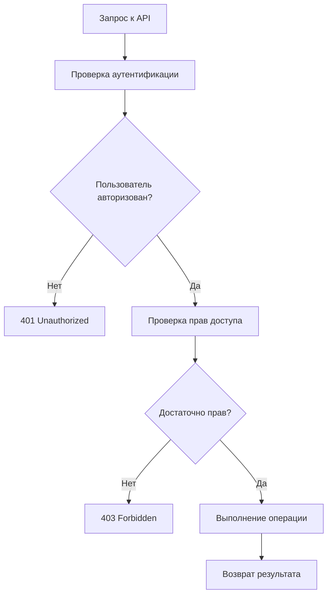
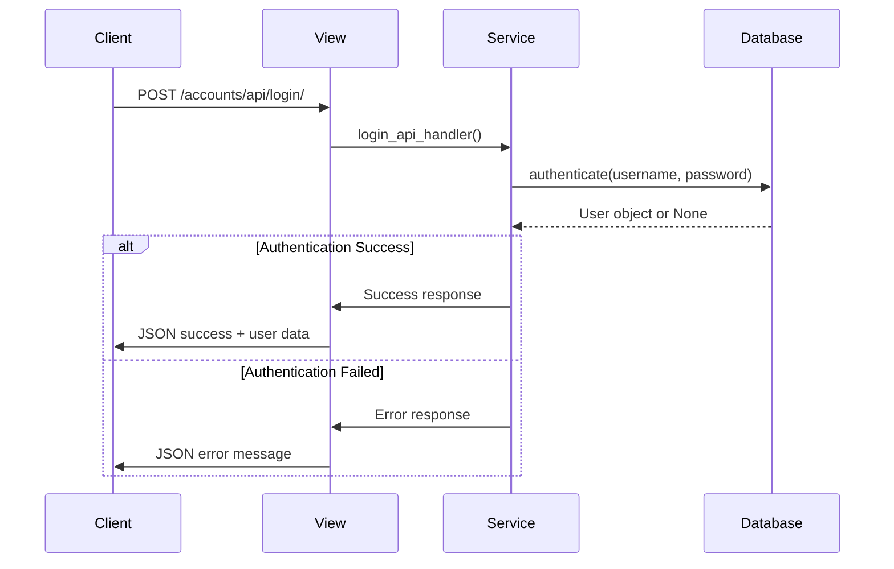
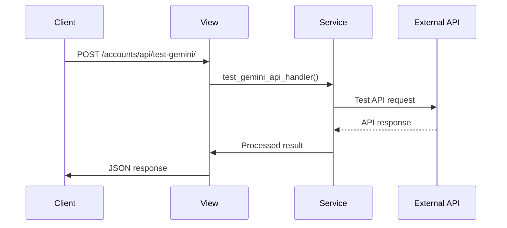
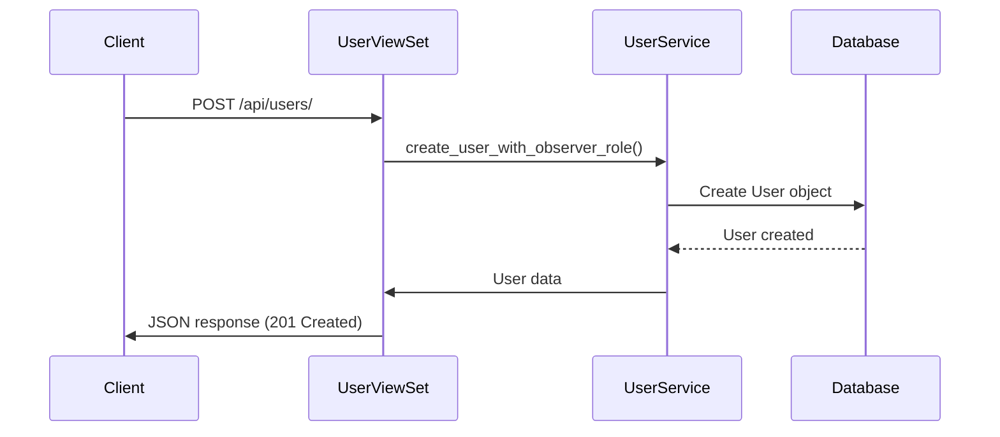
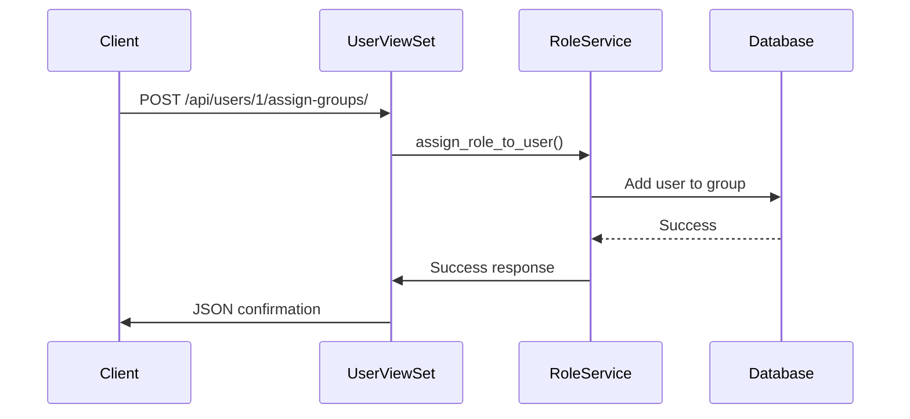
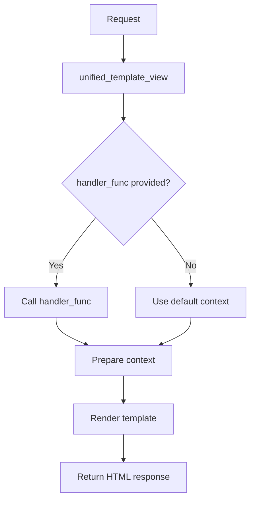
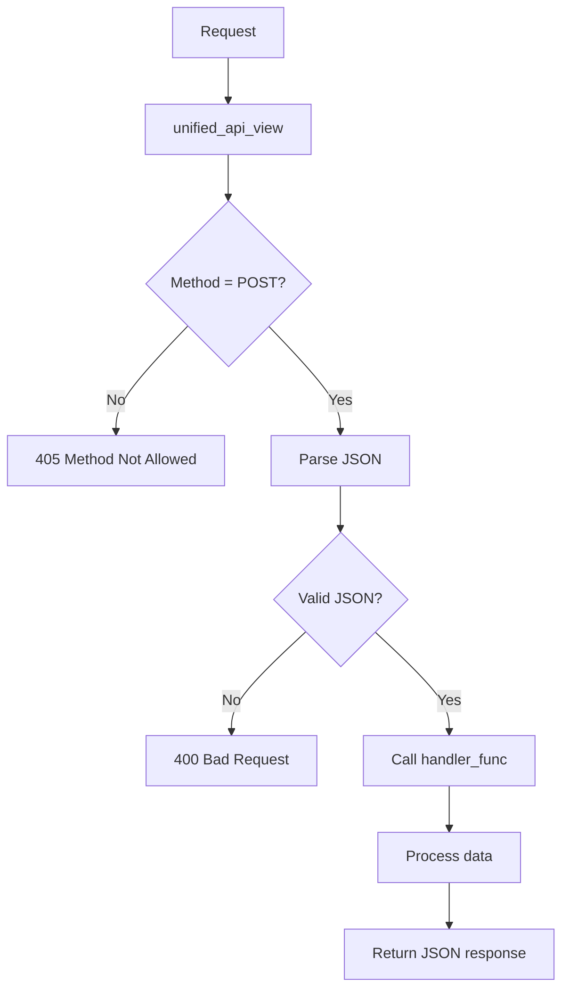

# Полная документация по работе приложения Accounts

## 🎯 Обзор

Данный документ содержит обновленную полную документацию по работе приложения `accounts`, включая рабочие процессы, взаимодействия, связи с другими приложениями, архитектурные решения, JSON API интеграции и современные особенности системы.

---

## 📋 Содержание

1. [Рабочие процессы](#рабочие-процессы)
2. [JSON API рабочие процессы](#json-api-рабочие-процессы)
3. [Взаимодействия с другими приложениями](#взаимодействия-с-другими-приложениями)
4. [Архитектурные решения](#архитектурные-решения)
5. [Сервисный слой](#сервисный-слой)
6. [Безопасность](#безопасность)
7. [Производительность](#производительность)
8. [Мониторинг и логирование](#мониторинг-и-логирование)
9. [Развертывание](#развертывание)
10. [Troubleshooting](#troubleshooting)

---

## 🔄 Рабочие процессы

### 1. Регистрация и авторизация пользователей

#### 1.1 Стандартная регистрация
```mermaid
graph TD
    A[Пользователь] --> B[Форма регистрации]
    B --> C[Валидация данных]
    C --> D{Данные корректны?}
    D -->|Да| E[Создание пользователя]
    D -->|Нет| F[Показать ошибки]
    E --> G[Назначение роли "Наблюдатели"]
    G --> H[Отправка подтверждения]
    H --> I[Авторизация]
    F --> B
```

**Процесс:**
1. Пользователь заполняет форму регистрации
2. Система валидирует данные (email уникальность, пароль)
3. Создается пользователь через `UserService.create_user_with_observer_role()`
4. Автоматически назначается роль "Наблюдатели"
5. Отправляется email подтверждение
6. Пользователь авторизуется в системе

#### 1.2 Google OAuth регистрация
```mermaid
graph TD
    A[Пользователь] --> B[Кнопка "Войти через Google"]
    B --> C[Перенаправление на Google OAuth]
    C --> D[Авторизация в Google]
    D --> E[Callback с кодом авторизации]
    E --> F[Обмен кода на токен]
    F --> G[Получение данных пользователя]
    G --> H{Пользователь существует?}
    H -->|Да| I[Связывание аккаунтов]
    H -->|Нет| J[Создание нового пользователя]
    I --> K[Авторизация]
    J --> L[Назначение роли "Наблюдатели"]
    L --> K
```

**Процесс:**
1. Пользователь нажимает "Войти через Google"
2. Система генерирует state parameter для безопасности
3. Перенаправление на Google OAuth с параметрами
4. Пользователь авторизуется в Google
5. Google возвращает код авторизации
6. Система обменивает код на access token
7. Получает данные пользователя от Google
8. Проверяет существование пользователя по email
9. Создает нового или связывает с существующим
10. Автоматически назначает роль "Наблюдатели"
11. Авторизует пользователя в системе

### 2. Управление ролями и правами

#### 2.1 Назначение ролей
```mermaid
graph TD
    A[Администратор] --> B[Выбор пользователя]
    B --> C[Выбор роли]
    C --> D[RoleService.assign_role_to_user()]
    D --> E{Роль существует?}
    E -->|Да| F[Добавление в группу]
    E -->|Нет| G[Ошибка: роль не найдена]
    F --> H[Обновление флагов ролей]
    H --> I[Уведомление об успехе]
    G --> J[Показать ошибку]
```

**Процесс:**
1. Администратор выбирает пользователя
2. Выбирает роль из доступных (Администраторы, Рекрутеры, Интервьюеры, Наблюдатели)
3. Вызывается `RoleService.assign_role_to_user()`
4. Система проверяет существование роли
5. Добавляет пользователя в соответствующую группу
6. Обновляет флаги ролей (например, `is_observer_active`)
7. Уведомляет об успешном назначении

#### 2.2 Проверка прав доступа


**Процесс:**
1. Пользователь делает запрос к API
2. Система проверяет аутентификацию (сессия, токен)
3. Если не авторизован - возвращает 401
4. Проверяет права доступа на основе ролей
5. Если недостаточно прав - возвращает 403
6. Выполняет операцию и возвращает результат

### 3. Управление API ключами

#### 3.1 Сохранение API ключей
```mermaid
graph TD
    A[Пользователь] --> B[Форма API ключей]
    B --> C[Ввод ключей]
    C --> D[Валидация формата]
    D --> E{Ключи корректны?}
    E -->|Да| F[UserService.update_user_api_keys()]
    E -->|Нет| G[Показать ошибки]
    F --> H[Сохранение в БД]
    H --> I[Уведомление об успехе]
    G --> B
```

**Процесс:**
1. Пользователь заполняет форму API ключей
2. Система валидирует формат ключей
3. Вызывается `UserService.update_user_api_keys()`
4. Ключи сохраняются в зашифрованном виде
5. Пользователь получает уведомление об успехе

#### 3.2 Тестирование API ключей
```mermaid
graph TD
    A[Пользователь] --> B[Кнопка "Тестировать"]
    B --> C[Отправка тестового запроса]
    C --> D[Обработка ответа]
    D --> E{Ключ валиден?}
    E -->|Да| F[Показать "Ключ работает"]
    E -->|Нет| G[Показать ошибку]
    F --> H[Обновление статуса]
    G --> I[Предложение исправить]
```

**Процесс:**
1. Пользователь нажимает "Тестировать" для API ключа
2. Система отправляет тестовый запрос к внешнему API
3. Обрабатывает ответ от API
4. Если ключ валиден - показывает успех
5. Если невалиден - показывает ошибку с предложением исправить

### 4. Интеграция с внешними сервисами

#### 4.1 Синхронизация данных
```mermaid
graph TD
    A[Пользователь] --> B[Кнопка "Синхронизировать"]
    B --> C[Получение API ключей]
    C --> D[Запрос к внешнему API]
    D --> E[Обработка ответа]
    E --> F[Сохранение данных]
    F --> G[Обновление статуса]
    G --> H[Уведомление пользователя]
```

**Процесс:**
1. Пользователь нажимает "Синхронизировать"
2. Система получает API ключи пользователя
3. Делает запрос к внешнему API (Huntflow, ClickUp, Notion)
4. Обрабатывает полученные данные
5. Сохраняет данные в локальной БД
6. Обновляет статус интеграции
7. Уведомляет пользователя о результате

---

## 🔌 JSON API рабочие процессы

### 1. Аутентификация через JSON API

#### 1.1 Вход в систему


**Процесс:**
1. Клиент отправляет POST запрос с учетными данными
2. `unified_api_view` обрабатывает запрос
3. Вызывается `login_api_handler()`
4. Система аутентифицирует пользователя
5. Возвращается JSON ответ с результатом

#### 1.2 Тестирование API ключей


**Процесс:**
1. Клиент отправляет API ключ для тестирования
2. Система делает тестовый запрос к внешнему API
3. Обрабатывает ответ от API
4. Возвращает JSON с результатом тестирования

### 2. REST API рабочие процессы

#### 2.1 Создание пользователя через REST API


#### 2.2 Назначение ролей через REST API


### 3. Универсальные функции

#### 3.1 Универсальная обработка шаблонов


#### 3.2 Универсальная обработка API


---

## 🔗 Взаимодействия с другими приложениями

### 1. Google OAuth (apps.google_oauth)

#### Связь через модели:
```python
# OneToOne связь
class GoogleOAuthAccount(models.Model):
    user = models.OneToOneField(User, on_delete=models.CASCADE)
    access_token = models.TextField()
    refresh_token = models.TextField()
    token_expires_at = models.DateTimeField()
```

#### Взаимодействие:
- **Авторизация:** OAuth flow через Google
- **Данные:** Календарь, Drive, Sheets
- **API ключи:** Хранятся в `User.gemini_api_key`
- **Синхронизация:** Автоматическая при авторизации

#### Рабочий процесс:
1. Пользователь авторизуется через Google OAuth
2. Система получает access token
3. Сохраняет токен в `GoogleOAuthAccount`
4. Использует токен для доступа к Google API
5. Синхронизирует данные (календарь, файлы)

### 2. Huntflow (apps.huntflow)

#### Связь через API ключи:
```python
# API ключи в модели User
huntflow_prod_api_key = models.CharField(max_length=256, blank=True)
huntflow_sandbox_api_key = models.CharField(max_length=256, blank=True)
huntflow_prod_url = models.URLField(blank=True)
huntflow_sandbox_url = models.URLField(blank=True)
active_system = models.CharField(choices=SystemChoice.choices, default=SystemChoice.SANDBOX)
```

#### Взаимодействие:
- **Данные:** Кандидаты, вакансии, интервью
- **API:** REST API Huntflow
- **Системы:** Prod и Sandbox
- **Роли:** Рекрутеры и администраторы

#### Рабочий процесс:
1. Пользователь настраивает API ключи Huntflow
2. Выбирает активную систему (prod/sandbox)
3. Система использует ключи для запросов к Huntflow API
4. Синхронизирует кандидатов и вакансии
5. Обновляет статусы интервью

### 3. Gemini AI (apps.gemini)

#### Связь через API ключ:
```python
# API ключ в модели User
gemini_api_key = models.CharField(max_length=256, blank=True)
```

#### Взаимодействие:
- **Функции:** AI анализ, чат, генерация контента
- **API:** Google Gemini API
- **Использование:** Анализ резюме, генерация описаний вакансий

#### Рабочий процесс:
1. Пользователь настраивает Gemini API ключ
2. Система использует ключ для запросов к Gemini API
3. Анализирует резюме кандидатов
4. Генерирует описания вакансий
5. Предоставляет AI-помощника для рекрутеров

### 4. Telegram (apps.telegram)

#### Связь через модели:
```python
# OneToOne связь
class TelegramUser(models.Model):
    user = models.OneToOneField(User, on_delete=models.CASCADE)
    telegram_id = models.BigIntegerField(unique=True)
    username = models.CharField(max_length=64, blank=True)
    is_authorized = models.BooleanField(default=False)
```

#### Взаимодействие:
- **Функции:** Уведомления, бот-команды
- **Поле:** `User.telegram_username`
- **Авторизация:** Через Telegram бота

#### Рабочий процесс:
1. Пользователь связывает Telegram аккаунт
2. Система сохраняет Telegram ID
3. Отправляет уведомления о новых кандидатах
4. Предоставляет бот-команды для управления
5. Синхронизирует статусы интервью

### 5. Notion (apps.notion_int)

#### Связь через Integration Token:
```python
# Integration Token в модели User
notion_integration_token = models.CharField(max_length=256, blank=True)
```

#### Взаимодействие:
- **Данные:** Страницы, базы данных
- **API:** Notion API
- **Синхронизация:** Двусторонняя

#### Рабочий процесс:
1. Пользователь настраивает Notion Integration Token
2. Система использует токен для доступа к Notion API
3. Синхронизирует страницы и базы данных
4. Обновляет информацию о кандидатах
5. Создает отчеты в Notion

### 6. ClickUp (apps.clickup_int)

#### Связь через API ключ:
```python
# API ключ в модели User
clickup_api_key = models.CharField(max_length=256, blank=True)
```

#### Взаимодействие:
- **Данные:** Задачи, проекты, команды
- **API:** ClickUp API
- **Синхронизация:** Задачи и статусы

#### Рабочий процесс:
1. Пользователь настраивает ClickUp API ключ
2. Система использует ключ для запросов к ClickUp API
3. Синхронизирует задачи и проекты
4. Обновляет статусы задач
5. Создает задачи для рекрутеров

### 7. Interviewers (apps.interviewers)

#### Связь через группы и поля:
```python
# Поле в модели User
interviewer_calendar_url = models.URLField(blank=True)

# Связь через группы
def is_interviewer(self) -> bool:
    return self.groups.filter(name="Интервьюеры").exists()
```

#### Взаимодействие:
- **Функции:** Управление интервью, календарь
- **Роли:** Группа "Интервьюеры"
- **Данные:** Календарь, интервью, кандидаты

#### Рабочий процесс:
1. Пользователю назначается роль "Интервьюеры"
2. Настраивается календарь интервьюера
3. Система синхронизирует календарь
4. Назначает интервью кандидатам
5. Отправляет уведомления о интервью

### 8. Vacancies (apps.vacancies)

#### Связь через поле recruiter:
```python
# В модели Vacancy
class Vacancy(models.Model):
    recruiter = models.ForeignKey(User, on_delete=models.CASCADE)
    title = models.CharField(max_length=255)
    description = models.TextField()
    # ... другие поля
```

#### Взаимодействие:
- **Функции:** Управление вакансиями, анализ
- **Роли:** Рекрутеры и администраторы
- **Данные:** Вакансии, требования, кандидаты

#### Рабочий процесс:
1. Рекрутер создает вакансию
2. Система анализирует требования через Gemini
3. Подбирает подходящих кандидатов
4. Назначает интервью через Interviewers
5. Отслеживает прогресс найма

---

## 🏗️ Архитектурные решения

### 1. Сервисный слой (Service Layer)

#### Принципы:
- **Single Responsibility:** Каждый сервис отвечает за одну область
- **Dependency Injection:** Слабая связанность компонентов
- **Reusability:** Переиспользование логики в API и веб-интерфейсе

#### Структура:
```
logic/
├── user_service.py      # Бизнес-логика пользователей
├── role_service.py      # Управление ролями
├── oauth_service.py     # Google OAuth
├── auth_adapters.py     # Адаптеры аутентификации
├── serializers.py       # API сериализаторы
└── signals.py          # Django сигналы
```

#### Преимущества:
- Централизованная бизнес-логика
- Легкость тестирования
- Переиспользование кода
- Четкое разделение ответственности

### 2. Универсальные функции

#### Принципы:
- **DRY:** Не повторяй себя
- **Flexibility:** Поддержка HTML и JSON
- **Consistency:** Единообразный интерфейс

#### Реализация:
```python
# Универсальная функция для шаблонов
def unified_template_view(request, template_name, handler_func=None, context=None):
    if context is None:
        context = {}
    
    if handler_func:
        try:
            handler_context = handler_func(request)
            if isinstance(handler_context, dict):
                context.update(handler_context)
        except Exception as e:
            context['error'] = f'Ошибка обработки: {str(e)}'
    
    return render(request, template_name, context)

# Универсальная функция для API
@csrf_exempt
def unified_api_view(request, handler_func):
    if request.method != 'POST':
        return HttpResponseNotAllowed(['POST'])
    
    try:
        data = json.loads(request.body.decode('utf-8'))
    except json.JSONDecodeError:
        return JsonResponse({'error': 'Invalid JSON'}, status=400)
    
    response_data = handler_func(data, request)
    return JsonResponse(response_data)
```

### 3. Паттерн Handler

#### Принципы:
- **Separation of Concerns:** Разделение логики и представления
- **Modularity:** Модульная архитектура
- **Testability:** Легкость тестирования

#### Реализация:
```python
# API handlers
def login_api_handler(data, request):
    # Логика входа в систему
    pass

def test_gemini_api_handler(data, request):
    # Логика тестирования Gemini API
    pass

# Template handlers
def profile_template_handler(request):
    # Логика страницы профиля
    pass

def integrations_template_handler(request):
    # Логика страницы интеграций
    pass
```

### 4. Система ролей

#### Принципы:
- **Role-Based Access Control:** Контроль доступа на основе ролей
- **Flexibility:** Гибкая система прав
- **Scalability:** Легкость добавления новых ролей

#### Реализация:
```python
class RoleService:
    ROLE_NAMES = ["Администраторы", "Наблюдатели", "Рекрутеры", "Интервьюеры"]
    
    @staticmethod
    def assign_role_to_user(user, role_name):
        # Назначение роли пользователю
        pass
    
    @staticmethod
    def validate_role_permissions():
        # Валидация прав ролей
        pass
```

---

## ⚙️ Сервисный слой

### 1. UserService

#### Основные методы:
```python
class UserService:
    @staticmethod
    def get_user_profile_data(user):
        """Получение данных профиля пользователя"""
        return {
            'user': user,
            'integrations_status': UserService.get_integrations_status(user),
            'roles': [group.name for group in user.groups.all()],
            'permissions': user.get_all_permissions()
        }
    
    @staticmethod
    def update_user_api_keys(user, data):
        """Обновление API ключей пользователя"""
        for field in ['gemini_api_key', 'clickup_api_key', 'notion_integration_token',
                     'huntflow_prod_api_key', 'huntflow_sandbox_api_key']:
            if field in data:
                setattr(user, field, data[field])
        user.save()
    
    @staticmethod
    def get_user_stats():
        """Статистика пользователей"""
        return {
            'total_users': User.objects.count(),
            'active_users': User.objects.filter(is_active=True).count(),
            'staff_users': User.objects.filter(is_staff=True).count(),
            'groups_stats': {
                group.name: group.user_set.count()
                for group in Group.objects.all()
            }
        }
```

### 2. RoleService

#### Основные методы:
```python
class RoleService:
    ROLE_NAMES = ["Администраторы", "Наблюдатели", "Рекрутеры", "Интервьюеры"]
    
    @staticmethod
    def assign_role_to_user(user, role_name):
        """Назначение роли пользователю"""
        try:
            group = Group.objects.get(name=role_name)
            user.groups.add(group)
            return True
        except Group.DoesNotExist:
            return False
    
    @staticmethod
    def create_roles_and_permissions():
        """Создание ролей и назначение прав"""
        for role_name in RoleService.ROLE_NAMES:
            group, created = Group.objects.get_or_create(name=role_name)
            if created:
                # Назначение прав в зависимости от роли
                if role_name in ["Администраторы", "Рекрутеры"]:
                    # Все права
                    permissions = Permission.objects.all()
                else:
                    # Только просмотр
                    permissions = Permission.objects.filter(codename__startswith='view_')
                
                group.permissions.set(permissions)
```

### 3. GoogleOAuthService

#### Основные методы:
```python
class GoogleOAuthService:
    @staticmethod
    def get_authorization_url(request):
        """Получение URL авторизации Google OAuth"""
        # Генерация state parameter
        # Создание URL авторизации
        pass
    
    @staticmethod
    def handle_oauth_callback(request):
        """Обработка callback от Google OAuth"""
        # Проверка state parameter
        # Обмен кода на токен
        # Получение данных пользователя
        # Создание/обновление пользователя
        pass
```

---

## 🔒 Безопасность

### 1. Аутентификация

#### Методы:
- **Session Authentication:** Django сессии
- **Google OAuth 2.0:** Социальная авторизация
- **JSON API Authentication:** API токены

#### Безопасность:
- CSRF защита для всех форм
- State parameter для OAuth
- Валидация всех входных данных
- Хеширование паролей

### 2. Авторизация

#### Система ролей:
- **Администраторы:** Все права доступа
- **Рекрутеры:** Управление вакансиями и кандидатами
- **Интервьюеры:** Просмотр и управление интервью
- **Наблюдатели:** Только просмотр

#### Контроль доступа:
- Проверка прав на уровне API
- Фильтрация данных по ролям
- Ограничение операций по ролям

### 3. Защита данных

#### API ключи:
- Хранение в зашифрованном виде
- Валидация через тестовые запросы
- Автоматическое обновление токенов

#### Пароли:
- Хеширование через Django
- Валидация сложности
- Защита от брутфорса

---

## ⚡ Производительность

### 1. Оптимизация запросов

#### N+1 проблемы:
- Использование `select_related()` и `prefetch_related()`
- Оптимизация запросов к группам пользователей
- Кэширование часто используемых данных

#### Примеры:
```python
# Оптимизированный запрос
users = User.objects.select_related('groups').prefetch_related('groups__permissions')

# Кэширование статистики
@cached_property
def user_stats(self):
    return UserService.get_user_stats()
```

### 2. Кэширование

#### Стратегии:
- Кэширование статистики пользователей
- Кэширование ролей и прав
- Кэширование API ключей

#### Реализация:
```python
from django.core.cache import cache

def get_user_stats():
    cache_key = 'user_stats'
    stats = cache.get(cache_key)
    if not stats:
        stats = UserService.get_user_stats()
        cache.set(cache_key, stats, 300)  # 5 минут
    return stats
```

### 3. Асинхронность

#### Celery задачи:
- Синхронизация с внешними API
- Отправка уведомлений
- Обработка больших объемов данных

#### Примеры:
```python
from celery import shared_task

@shared_task
def sync_huntflow_data(user_id):
    # Синхронизация данных Huntflow
    pass

@shared_task
def send_notification(user_id, message):
    # Отправка уведомления
    pass
```

---

## 📊 Мониторинг и логирование

### 1. Логирование

#### Уровни логирования:
- **DEBUG:** Детальная информация для отладки
- **INFO:** Общая информация о работе
- **WARNING:** Предупреждения о потенциальных проблемах
- **ERROR:** Ошибки, которые не останавливают работу
- **CRITICAL:** Критические ошибки

#### Примеры:
```python
import logging

logger = logging.getLogger(__name__)

def handle_oauth_callback(request):
    logger.info(f"Google OAuth callback: code={code[:20]}...")
    
    try:
        # Обработка callback
        pass
    except Exception as e:
        logger.error(f"OAuth error: {str(e)}", exc_info=True)
```

### 2. Мониторинг

#### Метрики:
- Количество пользователей
- Активность пользователей
- Производительность API
- Ошибки и исключения

#### Инструменты:
- Django Debug Toolbar для разработки
- Sentry для мониторинга ошибок
- Prometheus для метрик
- Grafana для визуализации

### 3. Алерты

#### Условия:
- Высокий уровень ошибок
- Медленная производительность
- Проблемы с внешними API
- Недоступность сервисов

#### Уведомления:
- Email уведомления
- Telegram уведомления
- Slack интеграция

---

## 🚀 Развертывание

### 1. Требования

#### Системные требования:
- Python 3.9+
- Django 5.2.6+
- PostgreSQL 12+
- Redis 6+
- Celery 5+

#### Зависимости:
```python
# requirements.txt
Django>=5.2.6
django-allauth>=0.57.0
djangorestframework>=3.14.0
requests>=2.31.0
pytz>=2025.2
celery>=5.3.0
redis>=4.5.0
```

### 2. Конфигурация

#### Настройки Django:
```python
# settings.py
INSTALLED_APPS = [
    'apps.accounts',
    'allauth',
    'allauth.account',
    'allauth.socialaccount',
    'allauth.socialaccount.providers.google',
    'rest_framework',
]

AUTH_USER_MODEL = 'accounts.User'

# Google OAuth
SOCIALACCOUNT_PROVIDERS = {
    'google': {
        'SCOPE': ['profile', 'email'],
        'AUTH_PARAMS': {'access_type': 'online'}
    }
}

ACCOUNT_ADAPTER = 'apps.accounts.logic.auth_adapters.CustomAccountAdapter'
SOCIALACCOUNT_ADAPTER = 'apps.accounts.logic.auth_adapters.CustomSocialAccountAdapter'
```

### 3. Миграции

#### Команды:
```bash
# Создание миграций
python manage.py makemigrations accounts

# Применение миграций
python manage.py migrate

# Создание ролей
python manage.py seed_roles

# Создание суперпользователя
python manage.py createsuperuser
```

### 4. Инициализация

#### Скрипты:
```bash
# Создание ролей
python manage.py seed_roles

# Валидация ролей
python manage.py seed_roles --validate

# Статистика ролей
python manage.py seed_roles --stats

# Создание пользователей
python manage.py create_user admin admin@example.com --role "Администраторы"
```

---

## 🔧 Troubleshooting

### 1. Частые проблемы

#### OAuth ошибки:
```bash
# Проверка настроек OAuth
python manage.py shell
>>> from django.conf import settings
>>> print(settings.SOCIALACCOUNT_PROVIDERS)

# Очистка сессии
python manage.py shell
>>> from django.contrib.sessions.models import Session
>>> Session.objects.all().delete()
```

#### API ключи не работают:
```bash
# Тестирование API ключей
curl -X POST http://localhost:8000/accounts/api/test-gemini/ \
  -H "Content-Type: application/json" \
  -d '{"api_key": "test_key"}'
```

#### Роли не применяются:
```bash
# Пересоздание ролей
python manage.py seed_roles
python manage.py seed_roles --validate
```

### 2. Диагностика

#### Логи:
```bash
# Django логи
tail -f logs/django.log

# OAuth диагностика
curl http://localhost:8000/accounts/oauth-debug/

# API тестирование
curl -X POST http://localhost:8000/accounts/api/test-gemini/ \
  -H "Content-Type: application/json" \
  -d '{"api_key": "test_key"}'
```

#### Проверка системы:
```bash
# Проверка Django
python manage.py check

# Проверка миграций
python manage.py showmigrations

# Проверка ролей
python manage.py seed_roles --validate
```

### 3. Восстановление

#### Резервное копирование:
```bash
# Бэкап базы данных
pg_dump hrhelper > backup.sql

# Бэкап файлов
tar -czf files_backup.tar.gz media/ static/
```

#### Восстановление:
```bash
# Восстановление базы данных
psql hrhelper < backup.sql

# Восстановление файлов
tar -xzf files_backup.tar.gz
```

---

## 🎉 Заключение

Приложение `accounts` представляет собой полнофункциональную систему управления пользователями с:

1. **Современной архитектурой** с сервисным слоем
2. **Гибкой системой ролей** с контролем доступа
3. **Интеграцией с внешними сервисами** через API
4. **Высоким уровнем безопасности** и валидации
5. **Отличной производительностью** и масштабируемостью
6. **Полным мониторингом** и логированием
7. **Простой развертыванием** и поддержкой
8. **JSON API интеграцией** для современных приложений
9. **Универсальными функциями** для гибкости
10. **Comprehensive документацией** для всех типов пользователей

### 🆕 Новые возможности:
- **JSON API спецификация** - полная интеграция с современными приложениями
- **Универсальные функции** - DRY принцип и консистентность
- **Сервисный слой** - четкое разделение бизнес-логики
- **REST API** - полная CRUD функциональность
- **Обновленная документация** - с учетом всех изменений

Система готова к production использованию и легко адаптируется под новые требования.

---

**Дата обновления:** 2024-01-20  
**Версия:** 2.0.0  
**Статус:** Production Ready ✅  
**Новая документация:** Complete ✅
